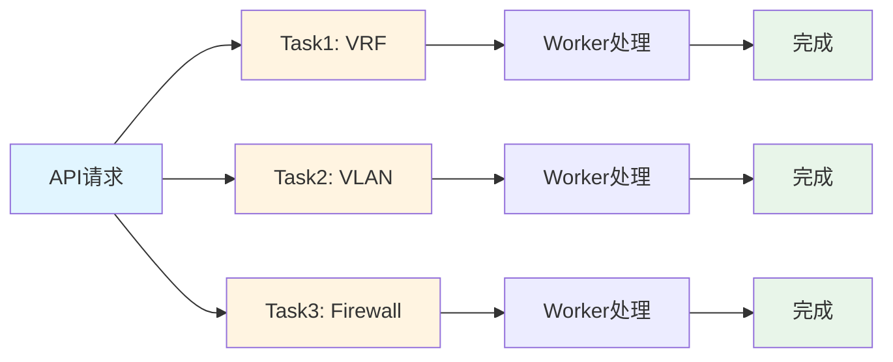
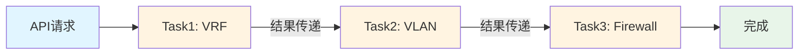
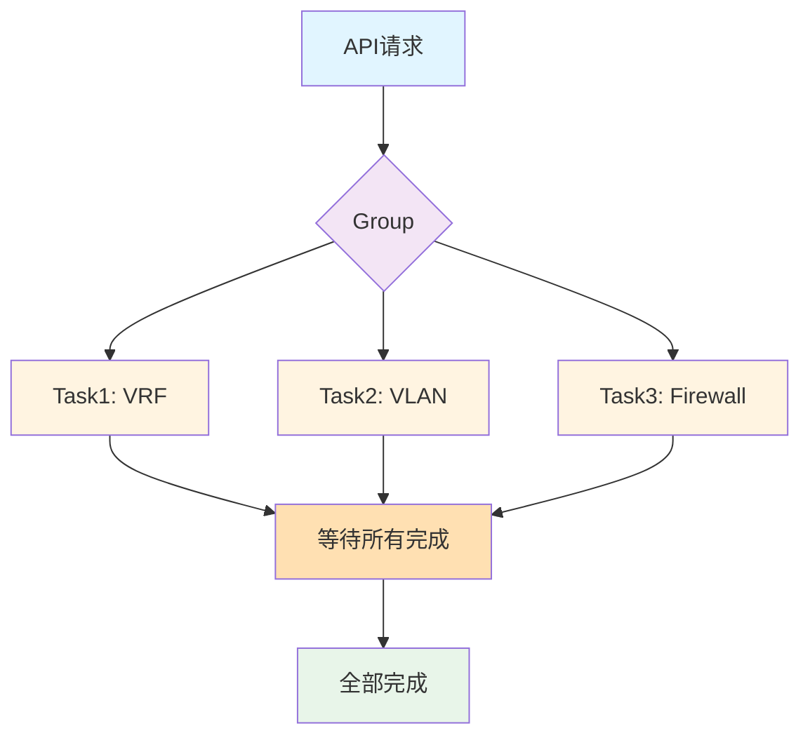
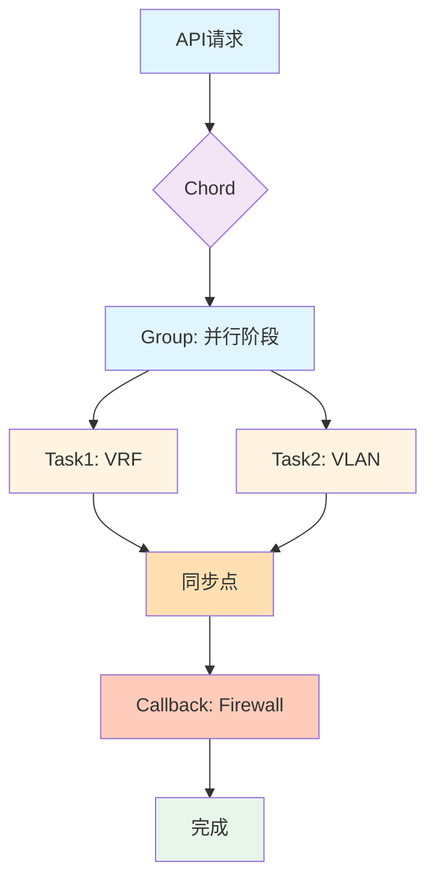
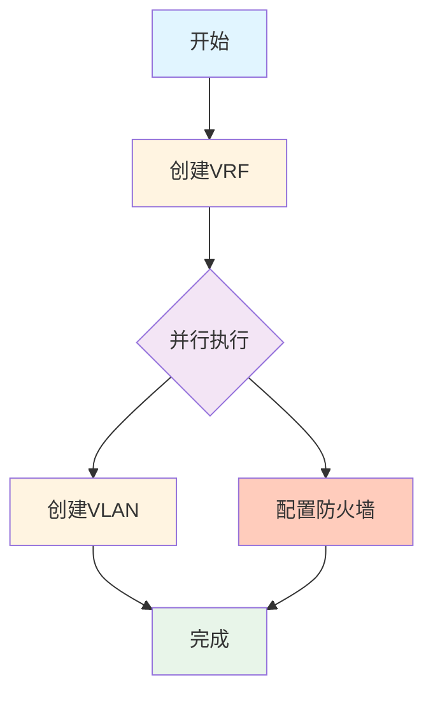
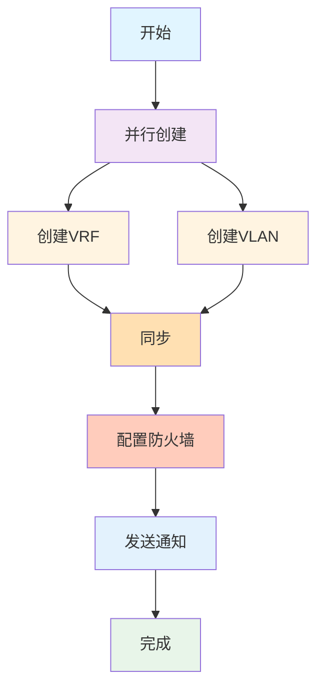
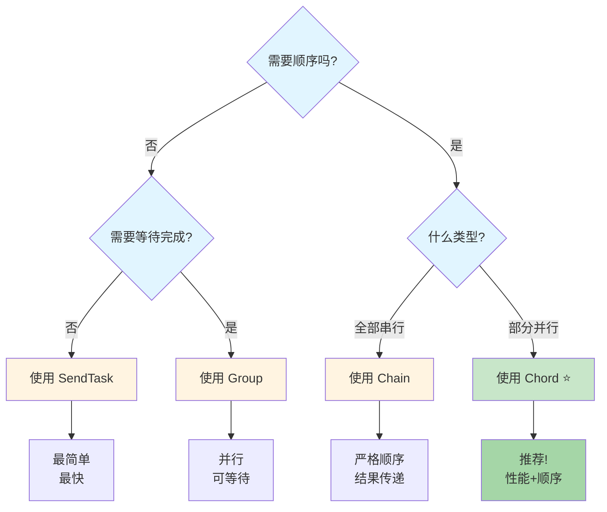

# Machinery 任务编排流程图

## 1. 独立任务 (SendTask)



**特点**: 
- 🔀 并行执行
- ⚡ 最快（~2秒）
- ❌ 无顺序保证

---

## 2. 任务链 (Chain)



**特点**:
- 🔗 严格顺序
- 📊 结果传递
- 🐌 最慢（~6秒）

---

## 3. 任务组 (Group)



**特点**:
- 🔀 并行执行
- ⏱️ 可等待全部完成
- ⚡ 快速（~2秒）

---

## 4. Chord (推荐) ⭐



**特点**:
- 🚀 并行 + 顺序
- ✅ 有序依赖
- ⚡ 中等速度（~4秒）

---

## VPC 创建工作流对比

### 时间线对比

#### 独立任务 (SendTask)
```
时间轴:  0s -------- 2s
        VRF     ████
        VLAN    ████
        FW      ████
                     ↑
              总耗时: ~2秒
              风险: 防火墙可能在VRF前创建
```

#### 任务链 (Chain)
```
时间轴:  0s -- 2s -- 4s -- 6s
        VRF   ████
        VLAN        ████
        FW                ████
                              ↑
                       总耗时: ~6秒
                       保证: 严格顺序
```

#### Group
```
时间轴:  0s -------- 2s
        VRF     ████
        VLAN    ████
        FW      ████
                     ↑
              总耗时: ~2秒
              可以等待所有完成
```

#### Chord (推荐) ⭐
```
时间轴:  0s -- 2s ---- 4s
        VRF   ████
        VLAN  ████
                   FW  ████
                            ↑
                     总耗时: ~4秒
                     保证: FW在VRF/VLAN之后
```

---

## 复杂编排示例

### 示例1: VRF -> (VLAN || Firewall)



**实现**:
```go
vrfTask := &tasks.Signature{
    Name: "create_vrf",
    OnSuccess: []*tasks.Signature{
        {Name: "create_vlan"},
        {Name: "create_firewall"},
    },
}
```

---

### 示例2: (VRF || VLAN) -> Firewall -> 通知



**实现**:
```go
// 第一阶段
group := tasks.NewGroup(
    &tasks.Signature{Name: "create_vrf"},
    &tasks.Signature{Name: "create_vlan"},
)

// 第二阶段: 防火墙
fwTask := &tasks.Signature{
    Name: "create_firewall",
    OnSuccess: []*tasks.Signature{
        {Name: "send_notification"},
    },
}

// 创建Chord
chord, _ := tasks.NewChord(group, fwTask)
```

---

## 决策树: 如何选择编排方式



---

## 总结

### 性能对比

| 模式 | 耗时 | 顺序保证 | 推荐度 |
|-----|------|---------|--------|
| SendTask | ⭐⭐⭐ (2秒) | ❌ | ⭐⭐⭐ |
| Chain | ⭐ (6秒) | ✅ | ⭐⭐ |
| Group | ⭐⭐⭐ (2秒) | ❌ | ⭐⭐⭐⭐ |
| **Chord** | **⭐⭐ (4秒)** | **✅** | **⭐⭐⭐⭐⭐** |

### VPC场景推荐: Chord ⭐⭐⭐⭐⭐

**理由**:
1. ✅ VRF和VLAN并行，节省50%时间
2. ✅ 防火墙在网络配置后执行，符合逻辑
3. ✅ 性能和顺序的完美平衡
4. ✅ 代码清晰易懂

**实现**: 参考 [api/server_advanced.go](../api/server_advanced.go)
