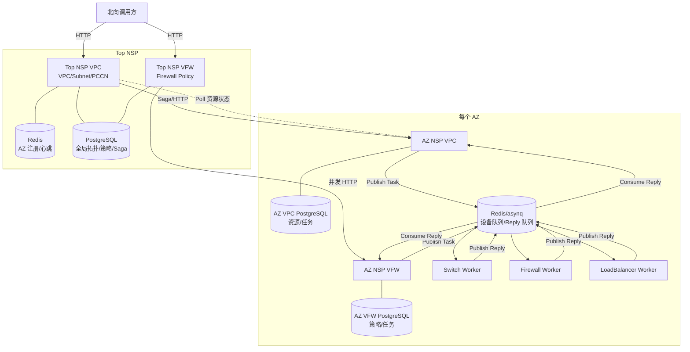
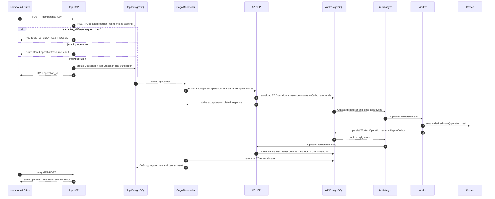
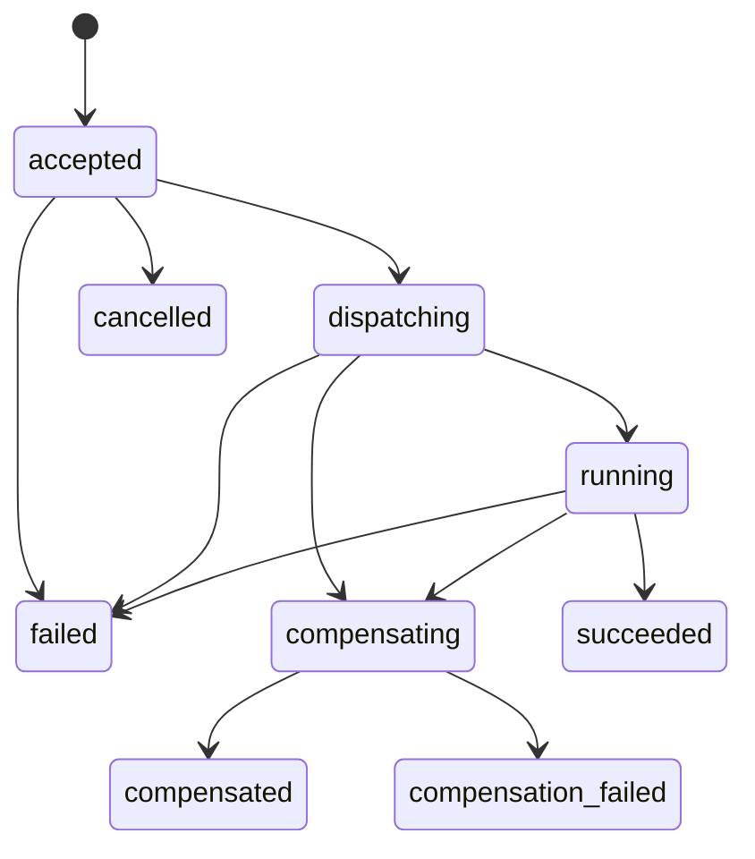
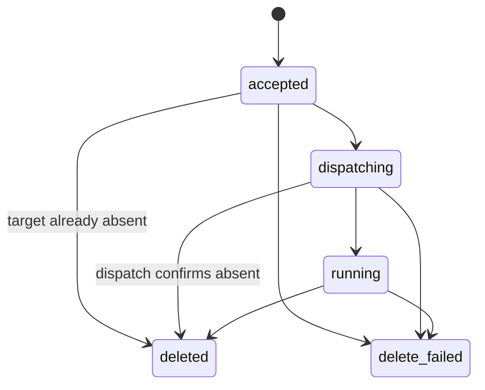
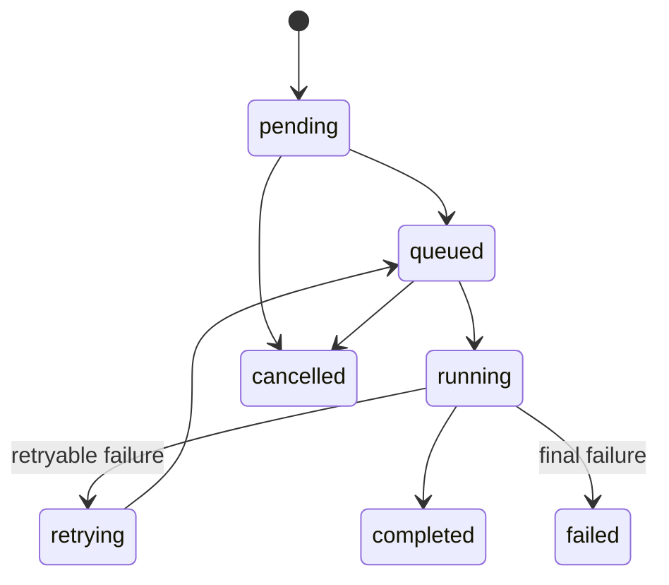

# NSP 幂等性现状分析与改造设计

## 1. 文档信息

| 项目 | 内容 |
| --- | --- |
| 文档目的 | 从软件工程和分布式系统角度审计当前 NSP 的幂等能力，并给出可供研发实施的目标设计 |
| 适用范围 | `top-nsp-vpc`、`top-nsp-vfw`、`az-nsp-vpc`、`az-nsp-vfw`、`worker`、Saga、Redis/asynq、PostgreSQL |
| 目标读者 | 架构师、服务端研发、网络设备适配研发、测试和运维人员 |
| 分析日期 | 2026-07-14 |
| 文档状态 | 待研发评审 |

## 2. 背景、目标与边界

### 2.1 背景

当前工程已经形成 Top NSP、AZ NSP 和设备 Worker 三层协作架构，并通过 HTTP、PostgreSQL、Redis/asynq 和 Saga 完成跨 AZ 编排以及 AZ 内任务执行。该架构天然包含多种可能重复执行的场景：

- 北向调用方因超时重试同一个 POST 或 DELETE；
- Saga 在 HTTP 响应丢失或进程恢复后重新执行 Step；
- Redis/asynq 按“至少一次”语义重新投递任务；
- Worker 已经完成设备操作，但 Reply 发布失败，导致整个 Handler 重试；
- Reply 消费失败、超时或并发消费，导致同一 Reply 被处理多次；
- 人工 Replay 与历史延迟 Reply 同时存在；
- Top NSP 或 AZ NSP 在数据库写入、消息发布等步骤之间崩溃；
- Saga 补偿操作、资源删除操作被重复调用。

如果这些重复执行没有统一幂等设计，系统可能出现重复设备配置、任务计数错误、状态回退、资源与任务失联、旧操作覆盖新操作等问题。

### 2.2 文档目标

本文目标不是只回答“代码里有没有唯一约束”，而是回答以下工程问题：

1. 系统在什么故障模型下需要幂等；
2. 当前每条关键链路是否满足业务幂等；
3. 不满足的原因属于设计缺失、实现错误、协议不兼容还是测试治理缺失；
4. 目标系统应使用哪些标识、事务边界、数据表和状态机；
5. 如何分阶段改造，并验证改造确实生效。

### 2.3 分析边界与假设

- 以当前代码为准，不以早期 MySQL 文档或旧入口为准；
- `go.mod` 通过 `replace github.com/jinleili-zz/nsp-platform => ../nsp-platform` 使用本地 `nsp-platform`，因此本文同时核对该依赖的 Saga 和 taskqueue 实现；
- Worker 当前主要记录日志并模拟执行，尚未调用真实设备 SDK。本文会分别描述“当前可观察问题”和“接入真实设备后会成为实际副作用的问题”；
- 本文讨论的是应用层可实现的 Effectively-once，不承诺跨 PostgreSQL、Redis 和真实网络设备的物理 Exactly-once；
- 本文是静态代码审计与目标设计，不代表已经完成运行时故障注入验证。

## 3. 什么是幂等

### 3.1 数学定义

在数学中，函数 `f` 满足以下关系时称为幂等：

```text
f(f(x)) = f(x)
```

例如，把一个值设置为 10 是幂等操作：执行一次或多次，最终值都是 10；在原值上加 10 则不是幂等操作，因为执行次数不同会产生不同结果。

### 3.2 软件工程中的业务幂等

在软件系统中，幂等通常表示：对于同一个业务操作，无论系统因为重试、重复消息、并发调用或故障恢复执行多少次，最终可观察业务状态与成功执行一次等价。

可以将它表达为：

```text
Apply(Operation, State) == Apply(Operation, Apply(Operation, State))
```

这里的关键不是“HTTP Handler 只进入一次”，而是以下业务结果保持等价：

- 只形成一个业务操作；
- 只产生一个资源 generation；
- 每个工作流 Step 只产生一次有效状态迁移；
- 设备最终配置与执行一次相同；
- 重复请求能返回第一次操作的资源 ID、操作 ID 和当前结果；
- 相同幂等键携带不同请求参数时，系统能够识别冲突，而不是覆盖原操作。

### 3.3 幂等不等于唯一约束

数据库唯一约束只能保证某些字段组合不能重复插入，它是实现幂等的重要工具，但不等于完整幂等。

例如第一次 `POST /vpc` 已经成功，但响应在网络中丢失；客户端使用同样参数重试，数据库唯一约束返回 duplicate key。此时虽然没有插入第二行，但客户端仍不知道第一次请求是否成功，也拿不到第一次的 `resource_id` 和 `operation_id`。这只能称为“重复检测”，不能称为完整的 API 幂等。

完整幂等至少需要保存：

- 重复操作的稳定身份；
- 第一次请求的参数指纹；
- 第一次创建的资源和工作流身份；
- 操作状态或可重放的响应。

### 3.4 幂等不等于 Exactly-once

跨数据库、消息队列和外部设备时，通常无法通过一个本地事务保证物理 Exactly-once：

```text
PostgreSQL commit
Redis publish
设备 API 调用
Reply publish
```

这些系统没有共同的原子事务。任何两个步骤之间都可能发生进程崩溃或网络超时。

工程上通常采用以下组合实现 Effectively-once：

```text
At-least-once delivery
        +
稳定 Operation/Event ID
        +
幂等生产者和消费者
        +
Transactional Outbox/Inbox
        +
CAS 状态迁移
        +
设备侧 ensure/reconcile
        =
Effectively-once business effect
```

系统允许底层消息被重复投递，但每次重复投递都被识别为同一个业务操作，最终只形成一次有效的逻辑副作用。

### 3.5 不同层次的幂等

| 层次 | 重复来源 | 推荐机制 |
| --- | --- | --- |
| HTTP API | 客户端超时、网关重试、服务间重试 | `Idempotency-Key`、请求指纹、响应缓存、自然键冲突检测 |
| 数据库 | 并发插入、重复状态更新 | 唯一约束、事务、UPSERT、CAS、行锁、版本号 |
| 消息生产 | DB 成功但 Publish 失败、进程重启 | Transactional Outbox、稳定 Event ID、可重复发布 |
| 消息消费 | 至少一次投递、消费者 ACK 丢失 | Transactional Inbox、Event ID 唯一约束、原子业务事务 |
| 工作流 | Step 重试、人工 Replay、恢复扫描 | Operation ID、Generation、Task ID、Attempt、单调状态机 |
| 设备执行 | 调用成功但响应丢失、Reply 发布失败 | 设备原生幂等 Token、create-or-get、ensure desired state、执行账本 |
| 删除与补偿 | 重复 DELETE、重复 Saga compensation | ensure absent、墓碑状态、稳定 compensation key |

### 3.6 幂等键的正确语义

幂等键不是简单地把资源名称作为 Key。推荐的判定模型是：

```text
scope = caller_identity + HTTP method + normalized path
key   = Idempotency-Key
hash  = canonical(request body + semantic query parameters)
```

处理规则：

1. `(scope, key)` 不存在：原子创建操作记录并开始执行；
2. `(scope, key)` 已存在且请求 hash 相同：返回原操作的结果或当前状态；
3. `(scope, key)` 已存在但请求 hash 不同：返回 `409 IDEMPOTENCY_KEY_REUSED`；
4. 相同资源自然键、不同幂等键且规格相同：由业务规则决定返回现有资源还是拒绝重复创建；
5. 相同资源自然键但规格不同：返回 `409 RESOURCE_SPEC_CONFLICT`，不能静默覆盖。

### 3.7 幂等状态机的基本要求

幂等状态机应满足：

- 状态迁移单调，终态不能被旧消息任意覆盖；
- 状态更新带预期状态或版本条件；
- 一次有效迁移与后续副作用位于同一个数据库事务中；
- 每一轮 Replay 使用新的 Attempt，但保留同一个 Task 身份；
- Reply 必须携带 Attempt 或 Generation，旧 Reply 不能推进新一轮操作；
- 查询结果可以从持久化状态重建，不能依赖请求进程内的 goroutine。

## 4. 当前系统架构与幂等边界

### 4.1 总体组件关系



### 4.2 Top NSP VPC/PCCN

Top NSP VPC 的职责包括：

- 在 Redis 中维护 AZ 注册和心跳；
- 在 PostgreSQL 中维护 VPC、Subnet、PCCN 全局拓扑；
- 为 Region 级 VPC 和 PCCN 构建 Saga；
- Saga 完成后在进程内启动 goroutine 轮询 AZ 业务终态；
- 将各 AZ 状态聚合到 Top 层。

VPC 创建的关键代码位于 `internal/top/orchestrator/orchestrator.go:75`：每次请求生成新的 VPC UUID，在每个 AZ 创建一个 Sync Saga Step，并在 Saga 提交后写 `vpc_registry`、启动状态 watcher。

PCCN 创建位于 `internal/top/orchestrator/orchestrator.go:568`，采用相同的“Saga 提交 + 业务轮询”模式。

Subnet 不走 Saga，Top 直接调用目标 AZ，成功后再写 Top 拓扑。

### 4.3 Top NSP VFW

Top NSP VFW 根据源/目的 IP 查询 `CIDR -> Zone -> AZ` 映射，然后并发调用目标 AZ VFW。

与 VPC 链路的主要差异是：

- 不使用 Saga；
- AZ 注册表保存在进程内 `map`；
- AZ API 接受工作流后，Top 就将策略标记为 `running`；
- 删除只删除 Top 数据库记录，没有向 AZ/Worker 下发删除任务。

### 4.4 AZ NSP

AZ NSP 是本地资源和任务状态的持有者：

- 先写 `vpc_resources`、`subnet_resources`、`pccn_resources` 或 `firewall_policies`；
- `SubmitWorkflow` 批量创建 Task；
- 更新资源 `total_tasks/status`；
- 向设备队列 Publish 第一个 Task；
- 消费 Reply 后更新 Task 和资源，并 Publish 下一个 Task；
- 通过补偿扫描将长时间不一致的资源标记为 `running` 或 `failed`。

共享工作流逻辑位于 `internal/orchestration/workflow.go`。

### 4.5 Worker 和队列

Worker 按 `WORKER_TYPE` 分为 `switch`、`firewall`、`loadbalancer`，监听：

```text
tasks:{region}:{az}:{device_type}[_critical|_high|_low]
```

Reply 队列为：

```text
replies:{region}:{az}:{service}
```

当前 Handler 的执行过程为“解析参数 -> 模拟设备操作 -> Publish Reply”。真实设备操作和 Reply 发布之间不存在共同事务。

## 5. 当前已有的局部幂等机制

### 5.1 数据库唯一约束

当前主要约束包括：

- `vpc_resources UNIQUE(vpc_name, az)`；
- `subnet_resources UNIQUE(subnet_name, az)`；
- `pccn_resources UNIQUE(pccn_name, az)`；
- `vpc_registry UNIQUE(vpc_name)`；
- `pccn_registry UNIQUE(pccn_name)`；
- `policy_registry UNIQUE(policy_name)`；
- `policy_az_records UNIQUE(policy_id, az)`；
- `firewall_policies UNIQUE(policy_name)`。

这些约束可以防止部分重复行，但不能重放第一次响应，也不能解决消息重复、状态迁移竞态和设备副作用重复。

### 5.2 Top 注册表 UPSERT

Top VPC、Subnet、PCCN 注册使用 `ON CONFLICT DO UPDATE`，能够避免 Top 表出现同名重复行。但当前 UPSERT 没有请求 hash 和 operation version，会把不同请求或不同 Saga 的状态写入同一行，因此它只是覆盖机制，不是安全的幂等机制。

### 5.3 Saga 自身的持久化与幂等 Header

本地 `nsp-platform` Saga 具有以下能力：

- Transaction 与 Steps 在同一个 PostgreSQL 事务中创建；
- 多实例通过 lease 和 CAS 协调；
- 恢复时可以重新驱动未完成事务；
- HTTP Step 携带 `X-Saga-Transaction-Id` 和 `X-Idempotency-Key`；
- Compensation 使用独立的 `step.ID + "-compensate"` 幂等键。

但 AZ NSP 没有消费和保存这些 Header，因此 Saga 发送的幂等身份在服务边界处丢失。

### 5.4 顺序重复 Reply 的终态检查

`Manager.HandleReply` 在更新前查询 Task；如果 Task 已经是 `completed` 或 `failed`，会忽略 Reply。这能处理“第一个 Reply 已完整提交后，第二个 Reply 串行到达”的情况。

它不能处理：

- 两个 Reply 同时读取到非终态；
- 第一次处理只提交了一半数据库更新；
- Task Replay 后旧 Reply 到达；
- 同一资源存在多组相同 `task_order` 的 Task。

### 5.5 AZ 注册与心跳

Top VPC 使用 Redis `SET` 和 `SADD` 保存 AZ 注册及心跳。从最终状态角度，重复注册和心跳基本是幂等的。这是当前链路中相对完整的局部幂等场景。

## 6. 幂等审计方法

本文对每个变更操作使用以下判定标准：

| 编号 | 判定问题 |
| --- | --- |
| I1 | 同一请求重复发送时，是否关联到同一个 Operation 和 Resource Generation？ |
| I2 | 第一次响应丢失后，调用方能否通过重试取得第一次结果？ |
| I3 | 相同幂等键携带不同参数时，是否明确返回冲突？ |
| I4 | DB 写入和消息发布之间发生崩溃时，是否能自动恢复且不重复副作用？ |
| I5 | 同一 Task/Reply 被并发处理时，是否只有一次有效状态迁移？ |
| I6 | 延迟消息、旧 Attempt Reply 是否会污染新一轮工作流？ |
| I7 | Worker 已完成设备操作但 Reply 丢失时，是否不会重复配置设备？ |
| I8 | DELETE/Compensation 重复执行时，是否都收敛到资源不存在？ |
| I9 | Top/AZ 重启后，是否能从持久化状态恢复未完成操作？ |
| I10 | 状态、计数、任务和设备配置之间是否保持可验证的一致性？ |

## 7. 未实现幂等的场景分析

### 7.1 Northbound VPC/PCCN 重复创建

#### 当前行为

`CreateRegionVPC` 和 `CreatePCCN` 每次调用都会：

1. 生成新的资源 UUID；
2. 构建新的 Saga Definition；
3. `SagaEngine.Submit` 生成新的 Saga Transaction ID；
4. 在 Saga 提交后 UPSERT Top 注册表；
5. 启动新的内存 watcher。

系统没有读取 Northbound `Idempotency-Key`，也没有按请求 hash 查询已有操作。

#### 重复场景

```text
Client                 Top NSP                 AZ NSP
  | POST VPC key=K        |                      |
  |---------------------->| create Saga T1       |
  |                       |--------------------->| 接受并开始 W1
  |       response lost   |                      |
  | POST VPC key=K        |                      |
  |---------------------->| create Saga T2       |
  |                       |--------------------->| 唯一键冲突或逻辑失败
```

可能结果：

- 一个业务意图产生 T1、T2 两个 Saga；
- T2 写入新的 `saga_tx_id/status`，覆盖 T1 的 Top 视图；
- T1、T2 watcher 都按资源名称更新同一行；
- 旧 watcher 可以覆盖新操作状态；
- 调用方拿不到第一次成功创建的 ID；
- 同名但不同参数的第二次请求可能覆盖 Top 元数据。

#### 归因

- **设计问题**：没有定义 Northbound 幂等协议和 Operation 聚合；
- **实现问题**：Top UPSERT 没有校验请求 hash，也没有按 `saga_tx_id/operation_id/version` 条件更新；
- **测试问题**：没有“响应丢失后重试”和“并发相同创建”的测试。

#### 目标行为

- 同一 `(scope, Idempotency-Key)` 只创建一个 Operation 和一个 Saga；
- 重复请求返回相同 `operation_id/resource_id/saga_tx_id`；
- 相同 Key、不同参数返回 409；
- Top 状态更新必须限定当前 Operation，旧 watcher 不能更新新操作。

### 7.2 Northbound Subnet/VFW 重复创建

Subnet 由 AZ 每次生成新 UUID，然后执行普通 INSERT。VFW 在 Top 和 AZ 同样生成新 UUID并执行普通 INSERT。唯一约束会使第二次请求失败，但不会返回第一次结果。

典型问题：

- AZ 已经插入 Subnet，但 Top 没收到响应，Top 重试得到 duplicate error；
- Top 因此不会注册 `subnet_registry/cidr_zone_mapping`；
- AZ 已存在资源，Top 却缺少拓扑；
- VFW 第一次已经下发到一个 AZ，第二个 AZ 调用超时；整体重试又可能遇到名称冲突，无法恢复第一次的 per-AZ 结果。

归因以**设计问题**为主：唯一约束被当成了完整幂等机制，没有操作记录和响应重放。

### 7.3 Saga Step 重试没有在 AZ 落地幂等

#### 当前行为

Saga Executor 会发送稳定的 Step 幂等键，并在以下场景重新执行 Sync Step：

- HTTP 请求成功但响应未收到；
- Saga 在 Step 被标记 `running` 后崩溃；
- Saga Coordinator 恢复 `running` Step；
- HTTP 返回可重试错误。

AZ API 没有读取 `X-Idempotency-Key` 或 `X-Saga-Transaction-Id`。每次进入 Handler 都被当作新的创建请求。

#### 后果

- VPC 普通 INSERT 发生唯一键冲突；
- Subnet、VFW 返回新的业务失败，而不是第一次响应；
- PCCN 进入存在缺陷的 conditional UPSERT；
- Saga 无法区分“第一次成功但响应丢失”和“真正执行失败”；
- 补偿可能删除第一次已经创建的资源。

#### 归因

- **设计问题**：Top/Saga 与 AZ 之间没有统一幂等契约；
- **实现问题**：Saga 已经提供 Header，但 AZ 未接入；
- **协议问题**：幂等身份没有贯穿请求、资源、工作流和 Reply。

### 7.4 当前 Saga 响应协议与 AZ API 不兼容

当前本地 `nsp-platform/saga/executor.go` 的成功响应解析要求：

- HTTP 状态码为 2xx；
- Body 是 JSON Object；
- Body 包含 `code`；
- `code` 转换为字符串后等于 `"0"`。

但 `VPCResponse`、`PCCNResponse` 只有 `success/message/...`，没有 `code`。因此按当前依赖构建时，即使 AZ 返回 HTTP 200 和 `success=true`，Saga 仍会以 `response missing code field` 判定失败。

这不是纯粹的幂等问题，但会触发更多重试和补偿，从而直接放大幂等风险。

归因是**跨组件协议兼容问题**，应在任何幂等改造前优先修复。

### 7.5 AZ 资源、Task 与首个消息不是原子创建

`SubmitWorkflow` 当前按以下独立步骤执行：

```text
INSERT resource
INSERT tasks (内部单独事务)
UPDATE resource.total_tasks
UPDATE resource.status=creating
PUBLISH first task to Redis
UPDATE task.status=queued, asynq_task_id=...
```

整个流程不存在统一事务或 Outbox。各故障窗口如下：

| 崩溃位置 | 持久化结果 | 当前恢复行为 | 风险 |
| --- | --- | --- | --- |
| Resource INSERT 后 | 资源 `pending`，无 Task | 补偿扫描在 `total=0` 时直接返回 | 永久孤儿资源 |
| Tasks INSERT 后 | Task 为 `pending`，消息未发布 | 超时后标记资源失败 | 工作流没有被恢复 |
| Resource `creating` 后 | 任务存在但首个消息未发布 | 只会超时失败 | 需要人工 Replay |
| Redis Publish 后、UpdateQueued 前 | Redis 有消息，DB Task 仍 `pending` | Submit 可能把资源标记失败 | Worker 实际执行与 DB 结论冲突 |
| UpdateQueued 成功、HTTP 响应前 | 工作流已经运行 | 客户端重试创建新操作 | 重复 Saga/冲突 |

#### 归因

- **设计问题**：跨 DB/Redis 双写没有采用 Outbox；
- **实现问题**：补偿扫描只判失败，不负责补投缺失消息；
- **工程问题**：没有对每个崩溃点进行故障注入测试。

### 7.6 PCCN conditional UPSERT 导致资源 ID 与 Task ID 脱节

`internal/db/dao/pccn_dao.go:20` 在 `(pccn_name, az)` 冲突时只更新 `status/subnets/updated_at`，不更新 ID；`CreatePCCN` 随后仍以本次请求中的新 `pccnID` 创建 Task。

存在两类确定性错误：

1. 旧状态为 `pending/failed/deleted`：SQL 更新旧行但保留旧 ID，新 Task 关联新 ID；
2. 旧状态为 `creating/running`：`DO UPDATE ... WHERE` 不满足，SQL 成功但影响 0 行，代码仍继续创建新 Task。

后续 `UpdateTotalTasks/UpdateStatus/IncrementCompletedTasks` 使用新 ID，会影响 0 行。任务可能执行完毕，但资源状态永远无法正确推进。

归因是**实现缺陷**，其根因是没有先定义“重复请求应复用旧 Operation，还是创建新 Generation”的设计语义。

### 7.7 Worker 设备操作与 Reply Publish 之间不幂等

当前 Worker Handler 的事务边界是：

```text
解析任务
执行设备操作
构造结果
Publish Reply
Handler return nil
```

如果设备操作成功但 Reply Publish 失败，Handler 返回 error，asynq 将再次执行整个 Handler。

```text
Attempt 1: device apply 成功 -> reply publish 失败 -> return error
Attempt 2: device apply 再次执行 -> reply publish 成功
```

当前模拟 Handler 只会产生重复日志和延迟；接入真实设备后可能产生：

- 重复添加路由；
- 重复创建安全策略或规则顺序变化；
- 重复创建 VLAN 子接口；
- 设备返回 already exists，但系统把它当作失败；
- 第一次和第二次执行结果不一致。

`taskqueue.Task` 没有供业务设置的稳定 Broker Task ID/Unique TTL；`workflow.Manager.publishTask` 也没有把数据库中的 `MaxRetries` 传给 Broker。当前 asynq 默认最大重试次数可能高于数据库初始值，从而进一步放大重复设备操作次数。

#### 归因

- **设计问题**：没有设备侧 Operation Key、执行账本和 ensure 模型；
- **实现问题**：Worker 没有在重试前检查已完成操作，也没有持久化成功结果；
- **依赖封装问题**：taskqueue 抽象未暴露确定性 Task ID/去重选项；
- **测试问题**：没有“设备成功、Reply 失败”的故障注入测试。

### 7.8 Reply 顺序重复、并发重复和部分提交

#### 当前顺序重复保护

当第一个 Reply 已经完整处理，Task 成为终态后，第二个 Reply 会被忽略。这只覆盖最简单的串行重复。

#### 并发重复问题

Reply Consumer 并发度大于 1。两个重复 Reply 可以同时执行：

```text
Consumer A                    Consumer B
读取 Task=queued              读取 Task=queued
Update completed              Update completed
completed_tasks + 1           completed_tasks + 1
查询 next pending             查询 next pending
Publish next                  Publish next
```

当前 `UpdateResult` 没有 `WHERE status IN (...)`，也没有检查 `RowsAffected`。资源计数更新和下一个 Task Publish 都是独立操作。

可能结果：

- `completed_tasks > total_tasks`；
- 同一下一 Step 被发布多次；
- Task 状态被成功 Reply 与失败 Reply 相互覆盖；
- 资源提前变为 `running` 或错误变为 `failed`。

#### 部分提交问题

如果成功 Reply 在以下位置失败：

- Task 已 `completed`，计数未增加：重试看到终态后直接忽略，计数永远缺失；
- 计数已增加，资源状态未更新：需要等待补偿扫描；
- Task 已完成但下一步未发布：重复 Reply 被忽略，工作流无法继续；
- 下一步已 Publish 但 DB 更新失败：存在重复执行风险。

#### 归因

- **设计问题**：没有 Inbox 和原子状态推进事务；
- **实现问题**：使用 check-then-act，而不是 CAS/行锁；
- **数据模型问题**：`tasks(resource_id, task_order)` 没有唯一约束和 Generation；
- **测试问题**：没有并发 Reply 测试。

### 7.9 Task Replay 与历史 Reply 乱序

Replay 会把失败资源重置为 `creating`，然后重新运行原 Broker Task 或重新 Publish Task。但是 Reply 只包含资源类型、资源 ID、Step Index 和总 Step 数，没有可靠携带：

- 数据库 Task ID；
- Operation ID；
- Generation；
- Attempt；
- Reply Event ID。

如果 Attempt 1 的成功 Reply 延迟到 Attempt 2 已经开始后到达，当前 Task 已从 `failed` 重新变为 `queued`，旧 Reply 会被当作 Attempt 2 的有效结果。

这可能跳过 Attempt 2 的真实执行结果，并错误推进下一 Step。

归因是**工作流身份模型的设计缺失**，不能仅通过局部加锁修复。

### 7.10 DELETE 与 Saga Compensation 不幂等

#### VPC/Subnet

- AZ VPC/Subnet 删除要求当前状态为 `running`；
- 第一次删除后状态变为 `deleting`，第二次删除返回错误；
- VPC/Subnet 没有对应设备删除工作流；
- Top VPC 删除只修改 Top 状态，不调用 AZ 删除。

#### PCCN

- AZ PCCN 删除要求 `running`；
- 然后直接删除数据库记录；
- 没有执行 `DeletePCCNConnectionHandler`；
- 第二次删除得到“不存在”；
- Saga 创建失败时资源通常还在 `pending/creating`，补偿 DELETE 会被拒绝。

#### VFW

- Top VFW 删除只删除 Top Policy 和 AZ Record；
- AZ VFW 删除只把本地策略标记 `deleted`；
- 没有删除真实防火墙规则的 Worker Task。

#### 归因

- **设计问题**：删除被设计为状态修改或数据库删除，而不是“确保业务和设备资源不存在”的工作流；
- **实现问题**：已有 PCCN Delete Handler 未注册到 Worker，也未进入删除编排；
- **语义问题**：Saga 注释认为 DELETE 幂等，但 API 对 `not found/deleting` 返回失败。

### 7.11 Top watcher 和业务聚合不能在重启后恢复

Saga Transaction 可以由 Saga Engine 恢复，但 `watchSagaAndPollAZs` 和 `watchPCCNSagaAndPollAZs` 只在处理创建请求时启动。

Top 异常退出后：

- Saga 可能继续或恢复执行；
- Top 的业务 watcher 不会自动重建；
- `vpc_registry/pccn_registry` 可能停在 `creating/interrupted`；
- 新请求可能创建第二个 Operation，而不是恢复旧 Operation。

此外，当前顺序是先 Submit Saga，再注册 Top 资源，注册失败只打印日志。这个窗口可能产生 AZ 已创建、Saga 已持久化，但 Top 没有业务记录的孤儿操作。

归因是**设计问题**：业务编排依赖进程内 goroutine，没有持久化 Operation Reconciler。

### 7.12 Top VFW 状态与真实 Worker 状态不一致

Top VFW 在 AZ API 返回“工作流已启动”后就更新 Top Policy 为 `running`，没有等待 AZ Worker Reply。即使 AZ Worker 随后失败，Top 仍可能保持 `running`。

这会破坏幂等重试的基础：调用方重试或查询时看到的“成功结果”不是设备终态，无法安全决定应该复用旧操作还是重新创建。

归因包括：

- **设计问题**：Top VFW 缺少持久化 per-AZ Operation 聚合；
- **实现问题**：把“成功受理”当作“业务执行完成”；
- **架构不一致**：Top VPC 使用 Redis Registry 和 Saga，Top VFW 使用内存 Registry 和直接并发调用。

### 7.13 Northbound 调用方作用域不可信

正确的 API 幂等键必须位于调用方作用域内，否则两个无关调用方碰巧使用相同 Key 时会被错误去重。当前工程虽然初始化了 AK/SK 认证能力，但 `top-nsp-vpc` 和 `top-nsp-vfw` 都在启动代码中强制关闭认证，Northbound 请求没有稳定、可信的调用方身份。

这意味着：

- 仅使用 `route + Idempotency-Key` 会要求所有调用方在全局范围生成不重复 Key；
- 使用来源 IP 作为作用域会被代理、NAT、重连和伪造影响，不能作为正确性依据；
- 客户端自报 `X-Client-Id` 若未签名，也不能作为可信隔离边界。

归因是**安全与幂等协议设计耦合问题**。目标方案应优先恢复 AK/SK/租户身份，并以认证主体作为 `caller_scope`；过渡期只能使用服务配置的固定命名空间并明确要求 Key 全局唯一。

## 8. 问题归因矩阵

| 编号 | 问题 | 主要归因 | 严重度 | 是否局部修复即可 |
| --- | --- | --- | --- | --- |
| A1 | Northbound 无幂等键和 Operation | 设计缺失 | P0 | 否，需要统一 API/Operation 设计 |
| A2 | Saga 幂等 Header 未被 AZ 消费 | 设计集成 + 实现缺失 | P0 | 部分，需要幂等表和 Handler 接入 |
| A3 | Saga 要求 `code=0`，AZ 响应没有 `code` | 协议兼容问题 | P0 | 是，但必须优先修复 |
| A4 | Resource/Task/Redis Publish 非原子 | 架构设计缺失 | P0 | 否，需要 Outbox |
| A5 | Worker 操作成功后 Reply 失败会重复设备操作 | 设备侧幂等设计缺失 | P0 | 否，需要 Operation Ledger/ensure |
| A6 | Reply check-then-act 并发竞态 | 实现错误 + Inbox 缺失 | P0 | 需要事务/CAS/Inbox 联合修复 |
| A7 | Reply 无 Attempt/Generation | 工作流身份设计缺失 | P0 | 否，需要扩展数据模型和消息协议 |
| A8 | PCCN UPSERT 保留旧 ID、Task 使用新 ID | 确定性实现缺陷 | P0 | 是，但应与 Operation 语义一起修复 |
| A9 | DELETE/Compensation 非 ensure-absent | 设计与实现问题 | P0 | 否，需要删除工作流 |
| A10 | Top watcher 不可恢复 | 持久化编排设计缺失 | P1 | 否，需要 Reconciler |
| A11 | Top JSON 状态 read-modify-write 竞态 | 实现问题/数据模型问题 | P1 | 可先 CAS，长期应拆 per-AZ 表 |
| A12 | Task 最大重试次数未传给 Broker | 实现缺陷 | P1 | 是 |
| A13 | Top VFW 受理后立即标记 running | 状态语义设计错误 | P1 | 需要增加终态聚合 |
| A14 | 无幂等/并发/崩溃专项测试 | 工程治理缺失 | P1 | 需要建立测试矩阵 |
| A15 | Top VPC/VFW 无可信 caller scope | 安全/幂等协议设计问题 | P1 | 需启用认证或可信租户身份 |

### 8.1 设计问题和实现问题的区分原则

本文采用以下标准分类：

- **设计问题**：系统没有定义完成该能力所需的身份、协议、持久化实体或事务边界，通常不能通过修改一个函数解决；
- **实现问题**：目标语义已经明确或基础机制已经存在，但代码没有正确使用，例如 Header 已发送但未读取、SQL 使用错误、状态更新缺少条件；
- **协议兼容问题**：两个独立组件对成功响应、消息字段或错误码理解不同；
- **工程治理问题**：设计和实现可能存在，但缺少自动化验证、故障注入、监控和发布控制，无法证明其可靠性。

当前工程的核心问题以**设计缺失为主、实现问题为辅**。仅增加更多唯一约束或捕获 duplicate key，无法达到端到端幂等。

## 9. 目标幂等架构

### 9.1 设计原则

改造后的系统应遵循以下原则：

1. **先定义业务操作，再执行工作流**：每个写请求先落为持久化 Operation，Operation 是查询、重试和恢复的统一入口；
2. **同一请求返回同一结果**：相同幂等键和相同规范化参数必须关联同一个 Operation；
3. **不同请求不能误去重**：相同幂等键但参数不同必须返回冲突，不得返回第一次请求的结果；
4. **资源身份和执行次数分离**：`resource_id` 标识资源实例，`generation` 标识该实例的当前执行世代，`attempt` 仅标识同一步骤的传输或执行尝试；
5. **状态只允许单调推进**：状态更新必须使用数据库事务和条件更新，终态不能被迟到消息改回中间态；
6. **数据库与消息队列通过 Outbox/Inbox 解耦**：不追求 PostgreSQL 与 Redis 的分布式事务，而以可重试投递和消费去重实现 effectively-once；
7. **外部副作用必须采用 ensure 语义**：Worker 不能把“消息只消费一次”等价为“设备只变更一次”；
8. **异步进度由持久化 Reconciler 驱动**：进程内 goroutine 只负责加速，不作为正确性的唯一来源；
9. **删除和补偿也是工作流**：创建、删除、补偿使用相同的 Operation、Generation、Outbox、Inbox 和状态机规则；
10. **所有正确性结论必须能通过故障注入测试证明**。

### 9.2 标识体系

| 标识 | 生成方 | 稳定范围 | 用途 |
| --- | --- | --- | --- |
| `idempotency_key` | API 调用方；Saga 步骤由 Saga 引擎生成 | 同一调用方、服务、路由和操作类型 | 识别“这是同一次业务请求” |
| `request_hash` | 接收服务 | 同一规范化请求体 | 防止相同幂等键被用于不同参数 |
| `root_operation_id` | 首个接收请求的 NSP | 一次业务意图全链路稳定 | 串联 Top、AZ、Task、Reply 和审计日志 |
| `operation_id` | 当前执行层 | 一个 Top 或 AZ 本地操作稳定 | 标识本层状态机；AZ 返回 child operation ID |
| `resource_id` | 资源归属层 | 一个资源实例稳定 | 标识 VPC/Subnet/PCCN/Policy 实例 |
| `generation` | 资源归属层 | 每次重新创建、重建或强制重放递增 | 隔离旧消息和当前资源状态 |
| `workflow_id` | AZ NSP | 一次 AZ 本地工作流稳定 | 区分同一 Operation 在不同 AZ 的执行 |
| `task_id` | AZ NSP | 一个确定的工作流步骤稳定 | Worker 重试时保持不变 |
| `attempt` | Broker/Worker 协作维护 | 每次实际执行尝试递增 | 诊断重试，不作为业务去重主键 |
| `event_id` | Outbox 生产者 | 每条逻辑事件稳定 | Inbox 消费去重 |
| `operation_key` | AZ NSP/Worker 协议约定 | 一个设备目标上的一个逻辑动作稳定 | 设备 SDK 或 Worker Ledger 幂等 |

关键关系如下：

```text
一个幂等作用域内的 idempotency_key -> 一个本地 operation_id
一个 root_operation_id              -> 一个 Top Operation 和多个 AZ Operation
一个 AZ operation_id                 -> 一个或多个 workflow_id
一个 workflow_id                     -> 多个确定的 task_id
一个 task_id                          -> 多个 attempt，但只有一个业务终态
一个 resource_id                      -> 多个 generation，但同一时刻只有一个有效 generation
```

Top 首次接收 Northbound 请求时，`root_operation_id` 与 Top 本地 `operation_id` 相同。AZ 为自己的状态机生成 `operation_id`，同时保存 Top 传入的 `root_operation_id` 和 `parent_operation_id`。禁止每次 HTTP 重试、消息重投或手工 replay 都生成新的 Operation、Resource 或 Task 标识。只有发起新的业务操作或明确创建新的资源世代时，才生成新的标识。

### 9.3 目标端到端流程



这套流程接受底层 HTTP 和 Redis/asynq 的 **at-least-once** 现实：消息可以重复、响应可以丢失、进程可以在任意两条语句之间退出，但每个阶段都有稳定标识、持久化事实和恢复入口。

### 9.4 分层责任

#### Top NSP

- 校验 Northbound `Idempotency-Key`；
- 持久化全局 Operation、原始请求摘要、最终响应摘要；
- 使用稳定的子操作键调用各 AZ；
- 聚合 per-AZ 状态，确保状态单调；
- 通过持久化 Reconciler 恢复 Saga 提交、状态轮询、删除和补偿；
- VPC、PCCN、VFW 使用同一套 Operation 语义，不再由各服务自行解释“受理”和“完成”。

#### AZ NSP

- 消费 Saga/Top 传入的幂等键、`root_operation_id` 和 `parent_operation_id`，创建或复用本地 `operation_id`；
- 在一个数据库事务中创建或复用 AZ Operation、Resource、Tasks 和首条 Outbox；
- 为 Resource 和 Task 维护 `generation`；
- 通过 Inbox 去重 Reply，通过 CAS 推进状态；
- 只把“下一步任务事件”写入 Outbox，不在业务事务中直接依赖 Redis 成功。

#### Worker

- 使用稳定 `operation_key` 执行 `ensure_present`、`ensure_configured` 或 `ensure_absent`；
- 在执行前读取 Worker Operation Ledger；已成功的操作直接返回已保存结果；
- 外部设备支持请求令牌时透传 `operation_key`；不支持时必须先查询设备实际状态再决定是否写入；
- 将结果落库后再通过 Reply Outbox 发布；
- 任何重试都不得依赖随机设备对象名或不可查询的临时状态。

#### Outbox Dispatcher / Reconciler

- 使用 `FOR UPDATE SKIP LOCKED` 支持多实例并发；
- 投递失败可退避重试；
- 投递成功但更新 Outbox 状态失败时允许重复投递，由 Inbox/Worker Ledger 去重；
- 定期扫描长时间处于 `processing`、`queued`、`running` 的记录并恢复；
- 仅根据数据库持久化状态决策，不依赖进程内内存。

## 10. 数据模型改造建议

以下 DDL 是目标模型的实现基线，用于指导 migration 设计；字段长度、schema 名称和公共审计字段可按工程规范调整。正式 migration 应拆分为“加字段/表、回填、启用写路径、加非空或唯一约束”多个可回滚阶段。

当前 migration 编号到 `004_create_pccn_tables.sql`。建议从 `005_create_operations.sql`、`006_create_outbox_inbox.sql`、`007_add_generation_and_worker_ledger.sql` 起按依赖拆分；生产约束收紧和旧字段清理应使用更晚的独立 migration，不能与首次建表混在一次发布中。

### 10.1 统一 Operation 表

Top NSP 和 AZ NSP 可以使用相同表结构但部署在各自数据库中。若服务共享数据库，建议增加 `owner_service` 明确归属，禁止跨服务直接更新对方记录。

```sql
CREATE TABLE orchestration_operations (
    operation_id       UUID PRIMARY KEY,
    root_operation_id  UUID NOT NULL,
    parent_operation_id UUID,
    owner_service      VARCHAR(64) NOT NULL,
    caller_scope       VARCHAR(128) NOT NULL,
    route_scope        VARCHAR(256) NOT NULL,
    operation_type     VARCHAR(64) NOT NULL,
    target_scope       VARCHAR(256) NOT NULL,
    idempotency_key    VARCHAR(256) NOT NULL,
    request_hash_version SMALLINT NOT NULL DEFAULT 1,
    request_hash       CHAR(64) NOT NULL,
    request_payload    JSONB NOT NULL,
    resource_type      VARCHAR(32) NOT NULL,
    resource_id        UUID,
    generation         BIGINT NOT NULL DEFAULT 1,
    status             VARCHAR(32) NOT NULL,
    response_code      VARCHAR(64),
    response_payload   JSONB,
    error_code         VARCHAR(64),
    error_message      TEXT,
    created_at         TIMESTAMPTZ NOT NULL DEFAULT NOW(),
    updated_at         TIMESTAMPTZ NOT NULL DEFAULT NOW(),
    completed_at       TIMESTAMPTZ,
    version            BIGINT NOT NULL DEFAULT 0,
    CONSTRAINT uq_operation_idempotency
        UNIQUE (owner_service, caller_scope, route_scope, idempotency_key)
);

CREATE INDEX idx_operations_reconcile
    ON orchestration_operations (owner_service, status, updated_at)
    WHERE status IN ('accepted', 'dispatching', 'running', 'compensating');

CREATE INDEX idx_operations_root
    ON orchestration_operations (root_operation_id, owner_service);
```

字段语义：

- `caller_scope`：认证启用后使用 AK、租户或调用方 ID；认证关闭的过渡期使用服务配置的固定调用方命名空间，**不得使用来源 IP**；
- `root_operation_id`：全链路相关 ID；Top Operation 通常等于自身 `operation_id`，AZ Operation 保存 Top ID；
- `parent_operation_id`：直接父操作 ID，仅用于关联，不建立跨数据库外键；
- `route_scope`：规范化 HTTP 方法和路由模板，例如 `POST /api/v1/vpc`，不能包含会因请求内容变化而变化的资源值；
- `operation_type`：如 `create_vpc`、`delete_vpc`、`create_pccn`、`apply_firewall_policy`；
- `target_scope`：资源名和作用域的规范化组合，例如 `region-a/vpc-a`，用于资源仲裁、查询和审计，并作为请求 Hash 的输入；
- `request_hash_version`：请求规范化算法版本；升级算法时仍能按旧版本验证存量 Key；
- `request_hash`：对路由参数、语义 query 和请求结构做稳定规范化后计算 SHA-256；只填充 API 契约中固定的默认值，不能把可能随配置变化的运行时默认值混入重试判定；
- `request_payload`：用于审计和响应重建；写入前必须移除凭证等敏感字段，必要时加密或只保存规范化摘要；
- `response_payload`：保存可安全重放给客户端的业务响应，不保存动态 trace、服务时间等非确定字段；
- `version`：乐观锁或 CAS 使用。

请求接入算法必须在事务中完成：

```text
1. 规范化请求并计算 request_hash。
2. 尝试 INSERT operation(status=accepted)。
3. 唯一键冲突时 SELECT 已有 operation。
4. request_hash 不同 -> 409；相同 -> 返回已有 Operation。
5. 只有 INSERT 成功者可以创建后续命令/Outbox。
```

`target_scope` 和 path 参数必须进入 `request_hash`，但不能加入幂等唯一约束来放宽 Key 的作用域；否则相同 Key 改用另一个资源名会绕过“同 Key、不同请求”的 409 检查。不能采用“先 SELECT、没有再 INSERT”的无锁写法；两个并发请求会同时通过查询。应以唯一约束作为并发线性化点，并正确处理冲突结果。

### 10.2 Top per-AZ 执行表

不要继续把所有 AZ 状态放在单个 JSON 字段中 read-modify-write。建议引入明细表：

```sql
CREATE TABLE operation_az_executions (
    operation_id       UUID NOT NULL REFERENCES orchestration_operations(operation_id),
    region              VARCHAR(64) NOT NULL,
    az                  VARCHAR(64) NOT NULL,
    child_operation_id  UUID,
    saga_transaction_id VARCHAR(128),
    status              VARCHAR(32) NOT NULL,
    error_code          VARCHAR(64),
    error_message       TEXT,
    version             BIGINT NOT NULL DEFAULT 0,
    updated_at          TIMESTAMPTZ NOT NULL DEFAULT NOW(),
    PRIMARY KEY (operation_id, region, az)
);

CREATE INDEX idx_operation_az_reconcile
    ON operation_az_executions (status, updated_at)
    WHERE status IN ('accepted', 'dispatching', 'running', 'compensating');
```

Top 汇总状态应由明细表计算或在同一事务中 CAS 更新。VPC、PCCN、VFW 都复用该表，避免 VFW 在 AZ 接口仅返回“已受理”时被误判为已完成。

### 10.3 Resource 的 Generation 与状态版本

现有 `vpc_resources`、`subnet_resources`、`pccn_resources`、`firewall_policies` 至少增加：

```sql
ALTER TABLE vpc_resources
    ADD COLUMN generation BIGINT NOT NULL DEFAULT 1,
    ADD COLUMN current_operation_id UUID,
    ADD COLUMN version BIGINT NOT NULL DEFAULT 0,
    ADD COLUMN deleted_at TIMESTAMPTZ;
```

其他资源表采用相同字段。建议的资源语义为：

- 同名、同作用域且活动资源已存在，请求参数相同：返回现有资源或当前 Operation；
- 同名、同作用域但请求参数不同：返回 `409 RESOURCE_SPEC_CONFLICT`；
- 已删除资源再次创建：新建业务 Operation，并将 `generation + 1`；
- 旧 generation 的 Reply、Replay、补偿不得修改新 generation；
- 若保留历史审计有强需求，长期应拆分逻辑资源表与不可变的 resource instance 表；首期可在原表更新 generation 并将历史写入 Operation/Audit 表。

两个不同幂等键并发创建同一个自然键资源时，Resource 唯一约束和行锁是第二个线性化点：只有一个请求可以建立工作流；另一个请求在规格相同时关联并返回现有资源/Operation，在规格不同时返回冲突，不能再创建一套 Task。

### 10.4 Task 唯一性与状态版本

`tasks` 表建议增加以下字段和约束：

```sql
-- 建议作为独立 migration 先执行；现有成功终态继续使用 completed。
ALTER TYPE task_status ADD VALUE IF NOT EXISTS 'retrying';

ALTER TABLE tasks
    ADD COLUMN root_operation_id UUID,
    ADD COLUMN operation_id UUID,
    ADD COLUMN workflow_id UUID,
    ADD COLUMN generation BIGINT NOT NULL DEFAULT 1,
    ADD COLUMN step_name VARCHAR(128),
    ADD COLUMN attempt INT NOT NULL DEFAULT 0,
    ADD COLUMN version BIGINT NOT NULL DEFAULT 0,
    ADD COLUMN last_event_id UUID;

CREATE UNIQUE INDEX uq_tasks_workflow_step
    ON tasks (workflow_id, generation, step_name);

CREATE INDEX idx_tasks_recovery
    ON tasks (status, updated_at)
    WHERE status IN ('pending', 'queued', 'running', 'retrying');
```

`step_name` 使用稳定常量，例如 `create_vrf_on_switch`，不能用展示文案。若同一工作流允许同名步骤重复，增加稳定的 `step_ordinal`，唯一键改为 `(workflow_id, generation, step_name, step_ordinal)`。

任务 ID 只在首次生成工作流时创建一次。Requeue/Replay 复用原 `task_id`，只递增 `attempt`；如果是“从某一步重新开始”的新业务操作，则创建新的 `workflow_id` 或递增 `generation`，不能把两种语义混在一个 replay 接口中。

### 10.5 Transactional Outbox

```sql
CREATE TABLE outbox_events (
    event_id         UUID PRIMARY KEY,
    event_key        VARCHAR(512) NOT NULL UNIQUE,
    aggregate_type   VARCHAR(64) NOT NULL,
    aggregate_id     VARCHAR(128) NOT NULL,
    event_type       VARCHAR(128) NOT NULL,
    destination      VARCHAR(256) NOT NULL,
    payload           JSONB NOT NULL,
    headers           JSONB NOT NULL DEFAULT '{}'::jsonb,
    status            VARCHAR(16) NOT NULL DEFAULT 'pending',
    publish_attempts  INT NOT NULL DEFAULT 0,
    available_at      TIMESTAMPTZ NOT NULL DEFAULT NOW(),
    locked_at         TIMESTAMPTZ,
    locked_by         VARCHAR(128),
    published_at      TIMESTAMPTZ,
    last_error        TEXT,
    created_at        TIMESTAMPTZ NOT NULL DEFAULT NOW(),
    updated_at        TIMESTAMPTZ NOT NULL DEFAULT NOW()
);

CREATE INDEX idx_outbox_dispatch
    ON outbox_events (available_at, created_at)
    WHERE status IN ('pending', 'retry');
```

推荐 `event_key`：

```text
task:{task_id}:generation:{generation}:dispatch
reply:{task_id}:generation:{generation}:attempt:{attempt}:final
top-operation:{operation_id}:az:{az}:submit
```

业务状态和 Outbox 必须在**同一个 PostgreSQL 事务**内提交。Dispatcher 发布到 Redis 成功后再标记 `published`。发布成功、标记失败会造成重复消息，这是预期场景，必须由消费端 Inbox 或 Ledger 消除。

Dispatcher 不应在持有业务行锁的数据库事务中调用 Redis。推荐用短事务批量 claim 事件并写入 `locked_by/locked_at`，提交后执行 Publish，再用独立短事务标记 `published`；定时扫描租约过期的 `publishing` 事件并重置为 `retry`。

重试采用有上限的指数退避并带抖动；超过阈值进入 `dead` 并告警，同时保留人工重新激活能力。进入 dead 不能被当作业务成功，关联 Operation 应保持可诊断的阻塞/失败状态。

### 10.6 Consumer Inbox

```sql
CREATE TABLE inbox_events (
    consumer_name   VARCHAR(128) NOT NULL,
    event_id         UUID NOT NULL,
    payload_hash     CHAR(64) NOT NULL,
    processed_at     TIMESTAMPTZ NOT NULL DEFAULT NOW(),
    result_code      VARCHAR(64),
    PRIMARY KEY (consumer_name, event_id)
);
```

Reply Consumer 的事务顺序：

1. `INSERT inbox_events`；冲突则校验 `payload_hash` 后直接确认消息；
2. 校验 `resource_id`、`generation`、`workflow_id`、`task_id` 和 `attempt`；
3. 使用 CAS 把 Task 从允许的前置状态推进到终态或 retrying；
4. 更新 Resource/Operation 聚合状态；
5. 若成功且还有下一步，在同一事务插入下一步 Outbox；
6. 提交数据库事务后才向 Broker 确认消费成功。

若同一个 `event_id` 对应不同 `payload_hash`，这是协议或数据损坏，必须进入死信/告警，不能按重复消息静默忽略。

Inbox 记录的保留期必须长于消息最大重试、归档重放和人工 Replay 窗口；清理过早会使历史重复消息重新产生副作用。资源编排建议将 Inbox 冷归档后再删除在线记录。

### 10.7 Worker Operation Ledger

```sql
CREATE TABLE worker_operations (
    operation_key    VARCHAR(512) PRIMARY KEY,
    root_operation_id UUID NOT NULL,
    operation_id      UUID NOT NULL,
    workflow_id       UUID NOT NULL,
    task_id           UUID NOT NULL,
    resource_id       UUID NOT NULL,
    generation        BIGINT NOT NULL,
    device_type       VARCHAR(32) NOT NULL,
    target_key        VARCHAR(256) NOT NULL,
    action            VARCHAR(64) NOT NULL,
    desired_hash      CHAR(64) NOT NULL,
    status            VARCHAR(24) NOT NULL,
    result_payload    JSONB,
    error_code        VARCHAR(64),
    error_message     TEXT,
    lease_owner       VARCHAR(128),
    lease_expires_at  TIMESTAMPTZ,
    created_at        TIMESTAMPTZ NOT NULL DEFAULT NOW(),
    updated_at        TIMESTAMPTZ NOT NULL DEFAULT NOW(),
    completed_at      TIMESTAMPTZ
);
```

Ledger 解决的是重复 Worker 消息的协调和结果重放，但它**不能单独解决**“设备成功、数据库未写成功”的原子性问题。设备操作必须至少满足下列一种能力：

1. 设备 API 原生支持幂等请求令牌，将 `operation_key` 透传；
2. 设备对象使用确定性唯一名称，并支持查询当前配置；
3. Driver 实现 `Get/Compare/Ensure`，执行前后都能确认期望状态；
4. 对不可查询且不支持幂等令牌的 API，引入人工确认/对账状态，禁止自动无界重试。

Worker 获取 Ledger 执行权时使用带租约的 CAS。租约过期后其他 Worker 可接管，但接管者必须先查询设备状态，不能直接再次发送创建命令。

## 11. API、消息协议与状态机

### 11.1 Northbound API 幂等契约

所有创建、更新、删除和显式 replay 接口均应支持：

```http
Idempotency-Key: <client-generated-stable-key>
```

Key 建议限制为 1～256 个可打印 ASCII 字符，服务端只在日志中记录 Key 的摘要，不记录原值。Key 不应承载密码、AK/SK、资源规格或个人数据。

建议响应统一包含：

```json
{
  "code": "0",
  "message": "accepted",
  "operation_id": "8c685d5d-41bc-4aa2-834a-3bc34f2c3c28",
  "resource_id": "fe6cc8af-ef07-483d-a70f-044d2f168703",
  "status": "accepted",
  "result": null
}
```

HTTP 和业务语义：

| 场景 | HTTP | 业务码 | 行为 |
| --- | --- | --- | --- |
| 首次接受异步操作 | `202` | `0` | 返回新 `operation_id` |
| 相同 Key、相同请求仍执行中 | `200` 或 `202` | `0` | 返回原 `operation_id` 和当前状态 |
| 相同 Key、相同请求已完成 | `200` | `0` | 返回已保存的最终结果 |
| 相同 Key、不同规范化请求 | `409` | `IDEMPOTENCY_KEY_REUSED` | 不执行新业务 |
| 同名资源存在但规格不同 | `409` | `RESOURCE_SPEC_CONFLICT` | 不覆盖已有资源 |
| 幂等键格式非法或必填但缺失 | `400` | `INVALID_IDEMPOTENCY_KEY` | 不创建 Operation |
| 服务暂时无法判定结果 | `503` | `OPERATION_UNAVAILABLE` | Operation 若已落库，响应中仍返回其 ID |

`GET /operations/:operation_id` 应成为统一查询入口；原有资源 status API 可保留，但响应中增加 `current_operation_id` 和 `generation`。

幂等记录保留时间必须覆盖调用方的最大重试窗口以及系统最长工作流时间。资源编排类操作建议长期保留 Operation 审计记录，而不是采用几个小时的短 TTL。若未来必须归档，归档表仍应保留唯一键摘要，避免 Key 被过早复用。

认证、必填字段和基本格式校验应在创建 Operation 前完成；一旦 Operation 已持久化，后续任何同步或异步错误都必须写回该 Operation。相同 Key 在 Operation 失败后仍返回原失败结果，不能悄悄重新执行；业务上确需再次尝试时，由调用方使用新 Key 发起新 Operation，并受 Resource generation/规格冲突规则约束。

### 11.2 Top 到 AZ 的 HTTP 契约

Top/Saga 请求至少携带：

```http
X-Root-Operation-Id: <top root operation id>
X-Parent-Operation-Id: <top local operation id>
X-Saga-Transaction-Id: <saga transaction id>
X-Idempotency-Key: <stable saga step id>
X-Resource-Generation: <generation>
```

AZ 的去重作用域建议为：

```text
owner_service=az-nsp-<service>
caller_scope=top-nsp-<service>
route_scope=<HTTP method + normalized route template>
idempotency_key=<X-Idempotency-Key>
request_hash=hash(path parameters + normalized body + semantic query)
```

当前 Saga executor 按响应 JSON 的 `code == "0"` 判断成功，因此 AZ 的 VPC、Subnet、PCCN 和 VFW Handler 必须统一返回 `code`。这属于先行兼容修复，不能等待完整幂等重构后再处理。

AZ 响应同时返回请求中的 `root_operation_id` 和本地 `operation_id`；Top 将后者保存到 `operation_az_executions.child_operation_id`，后续按 child Operation 查询状态，不再仅按资源名称轮询。

相同 Saga Step 重试时，AZ 返回第一次的 Operation/Resource 结果；补偿步骤使用独立的 `X-Idempotency-Key`（当前 Saga 已使用 `step-id-compensate` 思路），但补偿动作本身必须是 `ensure_absent`。

### 11.3 Task 消息协议 v2

建议在业务 Payload 或稳定 envelope 中显式携带：

```json
{
  "schema_version": 2,
  "event_id": "0e43a209-341a-40c1-bdd4-0ae38b487605",
  "root_operation_id": "8c685d5d-41bc-4aa2-834a-3bc34f2c3c28",
  "operation_id": "af154137-901f-4292-9060-bd19f9704f06",
  "workflow_id": "ae68fcd8-128c-459c-82cb-e42bb01376cc",
  "resource_type": "vpc",
  "resource_id": "fe6cc8af-ef07-483d-a70f-044d2f168703",
  "generation": 3,
  "task_id": "382cf45e-7fe7-47df-8c0d-9d56c3740bcf",
  "step_name": "create_vrf_on_switch",
  "step_ordinal": 1,
  "attempt": 1,
  "operation_key": "switch:create_vrf:fe6cc8af-ef07-483d-a70f-044d2f168703:gen:3",
  "desired_spec": {},
  "desired_hash": "<sha256>",
  "reply_queue": "replies:region-a:az-a:vpc"
}
```

不能只通过 `step_index` 和 `resource_id` 反查 Task。消息必须直接带 `task_id`、`workflow_id` 和 `generation`，使消费者能拒绝迟到或串线消息。

`MaxRetry` 应从数据库 Task 显式传给 `taskqueue.Task.MaxRetry`。数据库 `max_retries`、消息中的最大重试次数和 asynq 实际配置必须一致，并通过测试读取 Broker TaskInfo/Inspector 验证。

### 11.4 Reply 消息协议 v2

```json
{
  "schema_version": 2,
  "event_id": "225d6f35-667d-4985-b80f-8c3603ec2c69",
  "root_operation_id": "8c685d5d-41bc-4aa2-834a-3bc34f2c3c28",
  "operation_id": "af154137-901f-4292-9060-bd19f9704f06",
  "workflow_id": "ae68fcd8-128c-459c-82cb-e42bb01376cc",
  "resource_id": "fe6cc8af-ef07-483d-a70f-044d2f168703",
  "generation": 3,
  "task_id": "382cf45e-7fe7-47df-8c0d-9d56c3740bcf",
  "step_name": "create_vrf_on_switch",
  "attempt": 1,
  "status": "succeeded",
  "final_failure": false,
  "result": {},
  "error": null,
  "occurred_at": "2026-07-14T10:00:00Z"
}
```

处理规则：

- `event_id` 已处理：返回成功，不能再次累计计数或发布下一步；
- `generation` 小于资源当前值：记录 stale 指标并确认消息，不更新业务状态；
- `generation` 大于资源当前值：视为协议错误，进入死信和告警；
- `task_id` 不属于该 workflow/resource：协议错误；
- 已终态 Task 收到不同结果：记录冲突，不能覆盖首个合法终态；
- 旧 `attempt` 的失败晚于新 `attempt` 的成功：忽略旧失败；
- 非最终失败只更新尝试信息，不增加 `failed_tasks`；
- 最终成功/失败只能通过 CAS 生效一次。

### 11.5 状态机

#### Operation 状态



删除是一个新的 Operation，不应把原创建 Operation 原地改成 deleting。删除 Operation 使用独立状态机：



创建操作的终态是 `succeeded/failed/cancelled/compensated/compensation_failed`，删除操作的终态是 `deleted/delete_failed`。删除请求与未完成创建发生竞争时，由 Resource 当前 Operation/version 仲裁：创建操作进入补偿或取消终态，删除操作继续确保资源 absent。任何终态都不可被普通迟到 Reply 回退。

Operation 状态与 Resource 状态不要混用：例如创建 Operation 的 `succeeded` 对应 VPC Resource 的 `running`，删除 Operation 的 `deleted` 对应 Resource 的 `deleted` tombstone。

#### Task 状态



示例 CAS：

```sql
UPDATE tasks
SET status = 'completed',
    result = $2,
    last_event_id = $3,
    version = version + 1,
    updated_at = NOW()
WHERE id = $1
  AND generation = $4
  AND status IN ('queued', 'running', 'retrying')
  AND attempt = $5;
```

只有 `RowsAffected = 1` 的消费者可以更新资源计数并创建下一步 Outbox。若为 0，必须读取当前记录判断是合法重复、迟到消息还是非法状态跳转。

资源计数若继续保留，必须由 Task 状态聚合或在同一事务内条件更新；不得用无条件 `completed_tasks = completed_tasks + 1` 处理 Reply。更稳妥的终态判定是查询当前 generation 下 Task 的状态分布，计数仅作为缓存。

### 11.6 删除、补偿和 Replay 语义

#### 删除

DELETE 的业务目标是“资源不存在”，因此：

- 资源本来不存在：返回成功，不返回 404 作为业务失败；
- 资源正在删除：返回原删除 Operation；
- 资源已删除：返回已完成的删除结果；
- 设备对象不存在：Worker `ensure_absent` 返回成功；
- 数据库清理必须晚于设备终态确认，或采用 tombstone 保留资源身份和 generation；
- 迟到的创建 Reply 受 generation 和 Operation 状态围栏，不能把资源改回 running。

#### 补偿

补偿不是数据库 `DELETE` 的同义词。每个正向步骤应定义对应的 ensure-absent/restore 操作，并满足重复补偿安全。补偿状态必须持久化到 Operation/Task；部分补偿失败应进入 `compensation_failed`，由 Reconciler 重试或人工处理。

#### Replay

现有 `/api/v1/task/replay/:task_id` 应拆清两种语义：

1. **传输重投**：原 Task 未终态，只重新投递同一 `task_id`，`attempt + 1`，复用 `operation_key`；
2. **业务重执行**：原 Task/Workflow 已终态，需要显式创建新 Operation，并递增 generation 或创建新 workflow。

不得将已成功 Task 原样改回 pending。强制业务重执行应要求新的 `Idempotency-Key`、操作原因和审计身份。

## 12. 关键事务边界与实现算法

### 12.1 Top 接收创建请求

单个事务内：

1. 写入/获取 `orchestration_operations`；
2. 校验 `request_hash`；
3. 对首次请求写入 top resource registry 的初始记录；
4. 为目标 AZ 写入 `operation_az_executions`；
5. 写入一个或多个 Saga submit Outbox；
6. 提交后返回 `operation_id`。

Saga 引擎也必须支持按外部键幂等提交。建议在 `nsp-platform/saga` 增加 `SubmitOnce(ctx, externalKey, def)`，在 Saga transaction 表对 `external_key` 建唯一约束，并让相同定义返回原 transaction ID、不同定义返回冲突。若不修改 Saga 引擎，Top Outbox 即便可重试，也仍存在“Saga 已创建但返回丢失”导致重复 Saga 的窗口。

### 12.2 AZ 接收工作流请求

单个事务内：

1. 以 Top/Saga 幂等键创建或获取 AZ Operation；
2. 对现有 Operation 校验请求 Hash；
3. 创建或获取 Resource，确定 `resource_id + generation`；
4. 一次性创建所有 Task，并依赖工作流步骤唯一约束处理并发；
5. 将 Resource 设为 creating/running-in-progress；
6. 写入第一步 Task 的 Outbox；
7. 提交后返回稳定响应。

当前 `SubmitWorkflow` 中的 BatchCreate、资源计数更新、状态更新和直接 Publish 必须重构为事务型 Repository 方法，例如：

```go
SubmitWorkflowTx(ctx context.Context, def WorkflowDef) (*Workflow, error)
```

该方法只写 PostgreSQL，不直接调用 Broker；Dispatcher 独立投递。

### 12.3 Reply 推进工作流

单个事务内：

1. 插入 Inbox；
2. 锁定 Resource 和对应 Task，或使用等价 CAS；
3. 校验 Operation/Generation/Attempt；
4. 条件更新 Task；
5. 根据 Task 状态聚合更新 Resource；
6. 若需要下一步，写入下一 Task Outbox；
7. 若工作流终止，更新 AZ Operation；
8. 提交并确认 Reply 消息。

这消除了当前 `Get -> UpdateResult -> Increment -> GetNext -> Publish` 链路中多个并发窗口。

### 12.4 Worker 执行

```text
1. 读取/创建 operation_key 对应 Ledger。
2. desired_hash 不同 -> 协议冲突，禁止执行。
3. Ledger=succeeded -> 复用已保存结果，确保 Reply Outbox 存在。
4. 获取或续租执行权；获取失败则让 Broker 重试。
5. Driver.Get 当前设备状态。
6. 已满足 desired_spec -> 记录 succeeded。
7. 未满足 -> Driver.Ensure(desired_spec, operation_key)。
8. 再次读取并验证实际状态。
9. 一个数据库事务内写 Ledger 终态和 Reply Outbox。
10. Dispatcher 负责投递 Reply。
```

若 Worker 在步骤 7 后、步骤 9 前崩溃，接管者通过步骤 5 识别设备已经满足目标，不会重复创建。此处的“可查询、可比较、可确保”是设备层幂等成立的必要条件。

### 12.5 Top 状态聚合

Top Reconciler 周期扫描非终态 `operation_az_executions`，查询 AZ Operation，而不是仅查询资源名称。每个 AZ 明细独立 CAS 更新；然后按如下规则聚合：

```text
全部 AZ succeeded                          -> Top succeeded
任一 AZ failed 且无需/未开始补偿           -> Top failed 或 compensating
所有已成功 AZ 均 compensated               -> Top compensated
任一补偿最终失败                           -> Top compensation_failed
仍有 AZ accepted/dispatching/running        -> Top running
```

Reconciler 必须可多实例并行、可租约接管，并能够在 Top 进程重启后从 PostgreSQL 恢复。进程内 watcher 可以保留为低延迟优化，但不能承担唯一推进职责。

### 12.6 推荐代码边界

为避免 Handler、DAO 和 Broker 再次互相穿透，建议引入以下窄接口。名称可以按工程习惯调整，职责边界不应弱化：

```go
type OperationService interface {
    Begin(ctx context.Context, cmd BeginOperationCommand) (
        op *Operation,
        decision BeginDecision, // new / replay / conflict
        err error,
    )
    Get(ctx context.Context, operationID string) (*Operation, error)
}

type WorkflowRepository interface {
    SubmitTx(ctx context.Context, cmd SubmitWorkflowCommand) (*Workflow, error)
    ApplyReplyTx(ctx context.Context, reply ReplyV2) (ApplyReplyResult, error)
    RequeueTx(ctx context.Context, taskID string, expectedAttempt int) error
}

type OutboxRepository interface {
    ClaimBatch(ctx context.Context, owner string, limit int) ([]OutboxEvent, error)
    MarkPublished(ctx context.Context, eventID string) error
    MarkRetry(ctx context.Context, eventID string, cause error, next time.Time) error
}

type DeviceDriver interface {
    Get(ctx context.Context, target TargetKey) (ActualState, error)
    EnsurePresent(ctx context.Context, key string, desired DesiredState) (ActualState, error)
    EnsureAbsent(ctx context.Context, key string, target TargetKey) error
}
```

实现约束：

- HTTP Handler 只做认证、解析、校验、调用 Service 和错误码映射；
- `OperationService.Begin` 内部以唯一约束解决并发，不向 Handler 暴露 duplicate-key 细节；
- `WorkflowRepository` 的 `Tx` 后缀表示该方法完成状态、Inbox/Outbox 的原子提交，不允许方法内部直接 Publish；
- Dispatcher 是独立组件，可在 AZ/Top 进程内启动，但通过租约支持多实例；
- Worker Handler 只做消息校验、Ledger 协调和 Driver 调用，设备厂商差异封装在 Driver；
- API/消息 DTO 与数据库 Model 分离，防止 migration 字段意外改变外部协议。

## 13. 分阶段实施路线

实施顺序按“先封堵确定性错误，再建立持久化身份和事务边界，最后下沉设备幂等”排列。每一阶段都应独立发布、可观测并满足对应退出条件。

### 阶段 0：协议和确定性缺陷修复（P0，短周期）

目标：先消除会让现有 Saga 和重试行为直接错误的实现问题。

改造项：

- 统一 AZ VPC/PCCN/VFW 写接口响应，成功时返回 `code: "0"`；
- AZ Handler 读取 `X-Saga-Transaction-Id`、`X-Idempotency-Key`，先将事务 ID 和 Key 摘要进入日志/trace，为下一阶段接表；
- 修复 PCCN UPSERT 保留旧 `resource_id` 但后续用新 ID 创建 Task 的问题：DAO 必须返回数据库实际 ID；
- `publishTask` 把 Task 的 `MaxRetries` 显式映射到共享 taskqueue 的 `MaxRetry` 字段；
- 给 Reply 更新增加最小 CAS，禁止同一 Task 被并发累计两次；
- 增加协议契约测试和并发 Reply 回归测试。

主要影响文件：

- `internal/az/api/server.go`
- `internal/az/vfw/api/server.go`
- `internal/az/orchestrator/orchestrator.go`
- `internal/db/dao/pccn_dao.go`
- `internal/orchestration/workflow.go`
- `internal/db/dao/task_dao.go`

退出条件：Saga 能正确识别 AZ 成功响应；相同 PCCN 请求不会产生孤儿 Task；配置的最大重试数与 Broker 实际值一致；并发相同 Reply 只推进一次。

### 阶段 1：Northbound 与 AZ HTTP 幂等（P0）

目标：同一个 API/Saga 请求无论顺序重试还是并发重试，都只创建一个 Operation 和一套资源工作流。

改造项：

- 新增 `orchestration_operations` migration、DAO 和 Service；
- Top VPC、Top PCCN、Top VFW 写接口接入统一 Idempotency middleware/service；
- 恢复或灰度启用 Top AK/SK/租户认证，以认证主体填充 `caller_scope`；
- AZ VPC、AZ PCCN、AZ VFW 消费 Saga Header 并接入相同模型；
- 请求模型做语义规范化并计算 Hash；
- 响应增加 `operation_id/resource_id/status/code`；
- 新增 `GET /api/v1/operations/:operation_id`；
- 对缺少 Header 的 v1 调用采用兼容策略，见第 14 节。

主要影响包：

- `internal/top/api`、`internal/top/vfw/api`
- `internal/az/api`、`internal/az/vfw/api`
- 新增 `internal/idempotency` 或 `internal/operation`
- `internal/db/migrations` 和对应 DAO

退出条件：相同 Key/相同参数得到同一 Operation；相同 Key/不同参数稳定返回 409；并发 100 次 POST 只产生一条 Operation 和一套业务记录。

### 阶段 2：AZ Outbox、Inbox 和工作流状态机（P0）

目标：消除 PostgreSQL 与 Redis 双写，以及 Reply 的 check-then-act 竞态。

改造项：

- 新增 Task 的 operation/workflow/generation/attempt/version 字段和唯一约束；
- 新增 `outbox_events`、`inbox_events`；
- 重构 `SubmitWorkflow` 为单事务持久化；
- 增加 Outbox Dispatcher，支持退避、租约、指标和死信；
- Task/Reply 协议升级到 v2；
- Reply Handler 使用 Inbox + CAS + next-step Outbox 单事务；
- Replay 明确区分消息重投和业务重执行；
- 为旧 v1 消息提供限期兼容消费者。

主要影响包：

- `internal/orchestration`
- `internal/db/dao`
- `internal/models`
- `cmd/az_nsp`、`cmd/az_nsp_vfw`
- `internal/queue`

退出条件：在每个数据库提交/消息发布崩溃点注入故障后，工作流最终均可恢复；无重复计数、无重复下一步、无永久丢失首任务。

### 阶段 3：Worker 与设备幂等（P0）

目标：保证消息重复和 Worker 崩溃不会造成设备重复对象或非确定配置。

改造项：

- 新增 `worker_operations` 和 Reply Outbox；
- 为 switch/firewall/loadbalancer 定义统一 Driver 接口：`Get`、`Compare`、`EnsurePresent`、`EnsureAbsent`；
- `tasks/handlers.go` 和 `tasks/pccn_handlers.go` 改为薄适配层；
- 设备对象名称、VRF/VLAN/Zone/Policy 标识全部确定化；
- 对未来真实 SDK 制定幂等能力清单：请求令牌、查询一致性、冲突码、删除不存在行为；
- 模拟 Handler 增加可控故障点，覆盖“设备成功后 Worker 崩溃”。

主要影响包：

- `tasks`
- `cmd/worker`
- 新增 `internal/device`、`internal/worker/operation`
- `internal/db/migrations`

退出条件：同一 Task 重复投递 N 次只产生一个设备逻辑对象；设备成功但 Reply 丢失后能自动恢复；不同 desired hash 使用相同 operation key 会被拒绝。

### 阶段 4：Top 持久化 Reconciler、删除与补偿（P1）

目标：进程重启、多实例和跨 AZ 部分失败下仍能收敛。

改造项：

- 新增 `operation_az_executions`；
- 将内存 watcher 改为 DB 驱动 Reconciler；
- 扩展 Saga 支持外部幂等提交键；
- 创建/删除/补偿统一为 Operation；
- 资源增加 generation/tombstone；
- 删除 Worker 步骤全面改为 `ensure_absent`；
- 增加对 stuck Operation、Outbox、Task、Worker lease 的扫描恢复。

主要影响包：

- `internal/top/orchestrator`
- `internal/top/vpc/dao`、`internal/top/pccn/dao`、`internal/top/vfw`
- `cmd/top_nsp`、`cmd/top_nsp_vfw`
- 本地依赖 `../nsp-platform/saga`

退出条件：任意 Top/AZ/Worker 重启后 Operation 自动继续；两个 Top 实例不会重复提交 AZ 子操作；重复删除和重复补偿结果一致。

### 阶段 5：VPC、PCCN、VFW 语义统一与治理（P1）

目标：不同业务服务共享同一套正确性模型、指标和运维手册。

改造项：

- Top VFW 从内存 AZ Registry/直接 fan-out 迁移到持久化 Registry + Operation/Reconciler；
- 统一资源状态、错误码和 Operation 查询协议；
- 建立幂等 SLO、告警、死信处理和人工恢复工具；
- 清理过渡消息协议和旧 Handler 分支；
- 将幂等契约纳入新增 ELB/NAT 等服务的架构准入项。

退出条件：VPC、Subnet、PCCN、VFW 通过同一套幂等契约测试；不存在仅在某个服务中的内存正确性状态。

## 14. 兼容、迁移与回滚策略

### 14.1 API 兼容

推荐分两步启用 Northbound 幂等键：

1. **兼容期**：`Idempotency-Key` 可选。带 Key 的请求使用严格幂等；不带 Key 的请求由服务生成 Key，但响应增加告警 Header 和日志，服务生成的 Key无法保护“响应丢失后的客户端重试”；
2. **强制期**：所有写接口缺少 Key 返回 400。可按调用方白名单逐步收紧。

Saga 到 AZ 的调用不需要兼容期，因为 Saga 已发送 `X-Idempotency-Key`，可直接启用。

### 14.2 数据库迁移

建议顺序：

1. 新表和新列先以 nullable/default 兼容形式上线；
2. 新代码双写旧字段和新字段，但读取仍以旧路径为主；
3. 回填存量 Resource 的 `generation=1`，为非终态记录生成迁移 Operation；
4. 切换读取到新模型并观察；
5. 创建 `NOT VALID` 约束并验证，之后再收紧非空/唯一约束；
6. 停止旧字段写入；
7. 在至少一个稳定发布周期后删除旧路径。

严禁直接给存在重复数据的表增加唯一索引。上线前先运行重复审计 SQL，并为冲突记录制定人工处置清单。

### 14.3 消息协议迁移

- v2 消息带 `schema_version`；
- Consumer 在兼容期同时解析 v1/v2，但 v1 只能获得有限保护；
- 升级顺序为 Consumer -> Producer，确保新消息不会先于解析能力上线；
- 队列中 v1 消息清空并超过最大重试/保留窗口后，才能删除 v1 分支；
- 不建议复用相同 JSON 字段表达不同语义。

### 14.4 发布控制

建议使用以下独立开关：

```text
idempotency.api.enforce
idempotency.az.consume_saga_key
workflow.outbox.enabled
workflow.reply_v2.enabled
worker.ledger.enabled
top.reconciler.enabled
```

开关用于灰度，不用于长期保留两套正确性模型。启用新写路径前必须确认对应消费者已部署。

### 14.5 回滚

- 代码回滚时保留新增表/列，旧版本忽略它们；不要在紧急回滚中删除数据结构；
- 已发送 v2 消息时不能回滚到只支持 v1 的 Consumer；
- Outbox 切回直接 Publish 前必须停止 Dispatcher 并核对 pending 事件，否则会双发；
- Worker Ledger 一旦用于真实设备，回滚版本仍需尊重 Ledger 和 `operation_key`，不能恢复为盲写；
- 所有回滚步骤必须先在故障演练环境验证。

## 15. 验收标准与测试设计

### 15.1 全局不变量

以下不变量是改造是否完成的最终判据：

1. 同一幂等作用域和 Key 最多对应一个 `operation_id`；
2. 同一 Key 不允许对应两个不同 `request_hash`；
3. 同一 workflow/generation/step 最多有一个 Task；
4. 一个 Task 可以有多个 attempt，但最多接受一个合法业务终态；
5. 同一 Reply `event_id` 最多改变一次业务状态；
6. `completed_tasks + failed_tasks <= total_tasks`；
7. Resource/Operation 进入终态后不能被普通迟到消息回退；
8. 旧 generation 的消息不能改变当前 generation；
9. 数据库中已提交的待发送业务事件最终可被 Dispatcher 发现；
10. 同一 `operation_key + desired_hash` 的设备逻辑副作用最终至多一次；
11. 删除成功后，资源数据库状态与设备实际状态均为 absent；
12. 服务重启和多实例切换不改变上述结论。

### 15.2 必测场景矩阵

| 场景 | 注入方式 | 期望结果 |
| --- | --- | --- |
| 顺序重复 POST 100 次 | 同 Key、同 Body | 同一 Operation/Resource/Workflow |
| 并发重复 POST 100 次 | barrier 同时发请求 | 仅一个 INSERT 胜出，其余返回相同结果 |
| 相同 Key 不同 Body | 修改 CIDR/Policy 规则 | 409，无业务覆盖 |
| Top 响应丢失 | 服务完成落库后断开连接 | 客户端重试获得原 Operation |
| Saga 请求成功但响应丢失 | AZ 返回前断链 | Saga 重试，AZ 不创建第二套 Task |
| AZ 提交事务后崩溃 | 在 commit 后、HTTP 返回前退出 | 重试返回原 AZ Operation |
| DB 成功、Redis 不可用 | 关闭 Redis | Outbox 保留 pending，恢复后投递 |
| Redis 成功、Outbox 标记前崩溃 | Dispatcher 故障点 | 消息可重复，消费只生效一次 |
| Worker 设备操作前崩溃 | Handler 故障点 | 重试正常执行一次 |
| Worker 设备操作后崩溃 | Ensure 后、Ledger commit 前退出 | 接管者查询设备，避免重复创建 |
| Reply 发布后 Worker 崩溃 | publish 后故障 | Reply 可重复，Inbox 只处理一次 |
| 两个 AZ Consumer 并发处理同 Reply | 并行投递同 event | Task/计数/下一步只推进一次 |
| 旧 attempt 失败晚于新 attempt 成功 | 调整消息顺序 | Task 保持 completed |
| 旧 generation Reply 迟到 | 删除后重建再投旧消息 | 新资源不受影响，stale 指标增加 |
| 相同 DELETE 重试 | 资源存在/删除中/已不存在 | 都收敛到 deleted/absent |
| 补偿重复执行 | 重复补偿步骤 | 设备和数据库仍为一致终态 |
| Top 重启 | Operation running 时 kill | Reconciler 接管并完成聚合 |
| AZ 重启 | 工作流中间 kill | Outbox/Reconciler 恢复下一步 |
| Worker 多实例抢占 | 租约过期/网络分区 | 最终一份逻辑副作用，无永久锁 |
| PCCN 同名并发创建 | 并发相同/不同参数 | 无孤儿 Task；不同规格冲突 |
| VFW 多 AZ 部分失败 | 一 AZ 失败 | Top 不提前成功，按策略失败/补偿 |

### 15.3 测试分层

- **单元测试**：请求规范化、Hash、状态迁移、错误码映射、消息校验；
- **DAO 并发测试**：真实 PostgreSQL 下验证唯一约束、CAS、`SKIP LOCKED` 和事务回滚；
- **契约测试**：Top/Saga/AZ 响应 `code`、Header 透传、Task/Reply v2 schema；
- **组件测试**：真实 Redis/asynq + PostgreSQL，验证 Outbox/Inbox；
- **故障注入测试**：在每个“外部副作用前后”和“事务提交前后”设置 failpoint；
- **E2E 测试**：Docker 多 AZ 环境重复执行 VPC、Subnet、PCCN、VFW 创建/删除；
- **长稳测试**：随机重复、乱序、进程 kill 和 Redis/PostgreSQL 短时不可用。

不能用纯 Mock 数据库证明并发幂等；唯一约束、事务隔离和锁行为必须在真实 PostgreSQL 上验证。

### 15.4 可观测性与告警

至少增加以下指标：

```text
nsp_idempotency_requests_total{service,result=new|replayed|conflict}
nsp_operation_duration_seconds{service,type,status}
nsp_outbox_pending_total{service,destination}
nsp_outbox_oldest_age_seconds{service,destination}
nsp_inbox_duplicates_total{consumer}
nsp_stale_messages_total{consumer,reason}
nsp_task_cas_conflicts_total{service}
nsp_worker_operation_replays_total{device_type}
nsp_worker_lease_takeovers_total{device_type}
nsp_reconciler_stuck_operations_total{service,status}
nsp_compensation_failures_total{service,resource_type}
```

日志统一携带 `trace_id`、`root_operation_id`、`operation_id`、`resource_id`、`generation`、`workflow_id`、`task_id`、`event_id`、`attempt`。不得把 trace ID 当幂等键：trace 用于观测，一次业务重试可能产生多个 trace。

建议告警：Outbox 最老事件超过阈值、非终态 Operation 超时、Worker lease 高频接管、同 Key 不同 Hash 冲突异常升高、stale generation 消息异常升高、补偿失败。

## 16. 资源类型专项改造说明

### 16.1 VPC

- `vpc_name + region/AZ` 是业务唯一维度，但不能代替 Operation；
- 三步创建必须属于同一 workflow/generation；
- VRF、VLAN 子接口、Firewall Zone 均使用确定性设备标识；
- 部分步骤成功后失败时，需要按逆序 ensure-absent 补偿；
- 多 AZ VPC 的 Top 终态以每个 AZ 明细终态为准。

### 16.2 Subnet

- 幂等作用域必须包含父 VPC 身份、AZ、Subnet 名称和 CIDR；
- 同名但 CIDR 不同必须冲突，不能静默更新；
- 路由配置应使用集合式 reconcile，重复配置不产生重复路由；
- 删除 Subnet 后的迟到 routing Reply 必须由 generation 阻断。

### 16.3 PCCN

- 当前最紧急的是 DAO UPSERT 后资源 ID 不一致问题；所有后续 Task 必须使用数据库返回的实际 `resource_id`；
- PCCN 两端 AZ 子操作使用同一 Top Operation、不同稳定 child key；
- 连接和两端路由分别具备确定性 `operation_key`；
- 任一端失败时，已成功端必须可重复补偿；
- Top 不能只按 PCCN 名称轮询，必须按 Operation/generation 聚合。

### 16.4 VFW Policy

- Policy 规则集合规范化后计算 Hash，明确规则顺序是否具有业务语义；
- Top VFW 不能在 AZ HTTP 返回 accepted 后视为最终完成；
- `policy_registry` 和 `policy_az_records` 应关联 `operation_id/generation`；
- Worker 对防火墙规则使用确定性 Policy/Rule ID，并通过 replace/reconcile 达成期望集合；
- Top/AZ VFW 应迁移到与 VPC 相同的持久化 Registry、Operation、Outbox/Inbox 和 Reconciler 模型。

### 16.5 ELB 与未来 NAT

ELB 当前只存在脚手架，NAT 尚未实现。新服务不得复制现有非幂等路径，应把本文件的 Operation、Generation、Outbox、Inbox、Worker Ledger 和测试不变量作为开发前置条件。

## 17. 风险、权衡与非目标

### 17.1 主要风险

- **迁移期双模型复杂度**：旧状态字段和新 Operation 并存时容易出现读写来源不一致，必须限制双写周期；
- **设备查询不一致**：真实网络设备可能存在最终一致性，Driver 需要定义确认窗口和不可判定状态；
- **数据库压力增加**：Outbox/Inbox/Ledger 会增加写入量，需要索引、归档和批量清理策略；
- **错误去重**：幂等作用域过宽会把不同业务误认为同一次；过窄则无法去重，必须使用契约测试固定；
- **无限重试**：幂等不等于应无限重试，永久错误必须进入终态和人工恢复；
- **人工操作绕过**：直接改库或直接操作设备会破坏期望状态，需要审计和对账工具。

### 17.2 关键权衡

- 选择 PostgreSQL 作为幂等事实源，牺牲少量写延迟，换取事务、唯一约束和可审计恢复；
- 接受消息至少一次投递，以 Outbox/Inbox 简化跨 PostgreSQL/Redis 一致性；
- 保存 Operation 历史会增加存储，但网络资源编排的审计价值高于短期空间成本；
- 强制客户端幂等键会增加接入要求，但这是跨网络超时后识别同一意图的唯一可靠方式。

### 17.3 非目标

本次改造不承诺：

- PostgreSQL、Redis 和设备之间的全局 ACID 事务；
- 任意第三方设备 API 天然 exactly-once；
- 通过全局分布式锁解决所有并发；
- 自动修复无法查询、无法撤销且没有幂等令牌的外部副作用；
- 在第一阶段完成 ELB/NAT 的完整产品能力。

目标是通过稳定身份、状态机、Outbox/Inbox、设备 ensure 和可恢复协调，实现可证明、可运营的 effectively-once 业务结果。

## 18. 研发实施检查清单

### 18.1 设计评审

- [ ] 每个写接口定义幂等作用域、Key 来源和请求规范化规则；
- [ ] 每个资源定义业务唯一键、`resource_id` 和 generation 规则；
- [ ] 每个状态定义允许的前置状态和终态；
- [ ] 每个设备步骤定义查询、比较、ensure-present、ensure-absent；
- [ ] 每个跨存储写入明确 Outbox/Inbox 边界；
- [ ] 每个补偿步骤能被重复执行；
- [ ] Saga 外部提交键方案通过共享平台评审。

### 18.2 开发完成

- [ ] 相同请求返回稳定 Operation 和响应；
- [ ] 相同 Key 不同请求返回 409；
- [ ] 所有消息带 operation/resource/generation/workflow/task/event 身份；
- [ ] 所有状态推进使用事务和 CAS；
- [ ] 业务事务内不直接依赖 Redis Publish 成功；
- [ ] Reply 去重与下一步创建位于同一事务；
- [ ] Worker 不执行不可查询的盲目重复创建；
- [ ] 删除不存在视为成功；
- [ ] Replay 的传输和业务语义已拆分；
- [ ] Top/AZ/Worker 重启后可自动恢复。

### 18.3 测试与发布

- [ ] 第 15.2 节所有场景进入自动化测试；
- [ ] PostgreSQL 并发测试使用真实数据库；
- [ ] Redis、数据库、进程 kill 故障注入通过；
- [ ] v1/v2 消息升级顺序和回滚步骤演练通过；
- [ ] Outbox、stuck Operation、补偿失败告警已配置；
- [ ] 灰度期间重复率、冲突率、stale 消息和最终收敛时间符合基线；
- [ ] 旧路径只在兼容窗口保留并有明确下线日期。

## 19. 代码证据索引

以下位置是本次分析与后续改造的主要落点；行号会随实现变化，研发应以符号名搜索为准。

| 证据/改造点 | 当前代码位置 | 说明 |
| --- | --- | --- |
| AZ VPC/Subnet/PCCN 工作流创建与删除 | `internal/az/orchestrator/orchestrator.go` | Resource、Task、发布和删除入口 |
| 共享工作流提交/Reply 推进/Replay | `internal/orchestration/workflow.go` | 当前非事务链路和 check-then-act 核心位置 |
| Task DAO | `internal/db/dao/task_dao.go` | 需增加事务、CAS、generation、attempt |
| PCCN UPSERT | `internal/db/dao/pccn_dao.go` | 需返回实际持久化 ID |
| AZ VPC API | `internal/az/api/server.go` | Saga Header、幂等请求、响应协议接入点 |
| AZ VFW API/编排 | `internal/az/vfw/api/server.go`、`internal/az/vfw/orchestrator/orchestrator.go` | 需与 VPC 统一 |
| Top VPC/PCCN 编排 | `internal/top/orchestrator/orchestrator.go` | Saga 提交、内存 watcher、删除/补偿 |
| Top topology DAO | `internal/top/vpc/dao/dao.go`、`internal/top/pccn/dao/dao.go` | 当前 UPSERT 与 JSON 聚合状态 |
| Top VFW | `internal/top/vfw` | 直接 fan-out 和 per-AZ 状态语义 |
| Top/AZ HTTP Client | `internal/client` | 稳定 Header、Operation 和错误码传递 |
| Top 启动与认证开关 | `cmd/top_nsp/main.go`、`cmd/top_nsp_vfw/main.go` | caller scope 的认证身份来源 |
| Worker Handler | `tasks/handlers.go`、`tasks/pccn_handlers.go` | 设备 ensure 和 Ledger 接入点 |
| Worker 注册 | `cmd/worker/main.go` | v2 Handler/Driver 装配 |
| 队列命名 | `internal/queue/queue.go` | Outbox destination 解析 |
| PostgreSQL 初始表 | `internal/db/migrations/001_init_postgresql.sql`、`004_create_pccn_tables.sql` | 新 migration 的存量基线 |
| Saga Header 和成功判定 | `../nsp-platform/saga/executor.go` | 已发送幂等 Header；需统一响应，并扩展幂等 Submit |
| taskqueue MaxRetry | `../nsp-platform/taskqueue` | Workflow 需把 DB 配置透传给 Broker Task |

## 20. 结论

当前系统具备部分局部去重能力，但尚不满足端到端幂等要求。最危险的窗口不在“数据库是否有唯一键”，而在以下四处：

1. Northbound/Saga 重试没有稳定、被消费的业务 Operation；
2. PostgreSQL 状态与 Redis/asynq 消息发布不是一个可恢复事务；
3. Worker 设备副作用与 Reply 发布之间没有 ensure/Ledger 保护；
4. Reply 以 check-then-act 推进，缺少 Inbox、Generation 和 CAS。

因此，推荐改造主线不是在现有 Handler 中零散增加“存在即返回”，而是建立统一的 **Operation + Generation + 状态机 + Transactional Outbox/Inbox + Worker Ensure/Ledger + 持久化 Reconciler**。阶段 0 可先修复确定性协议和实现缺陷，但只有完成阶段 1 至阶段 4，并通过第 15 节故障注入测试，才能宣称 VPC、Subnet、PCCN 和 VFW 在定义的重试窗口和故障模型下达到业务 effectively-once。
