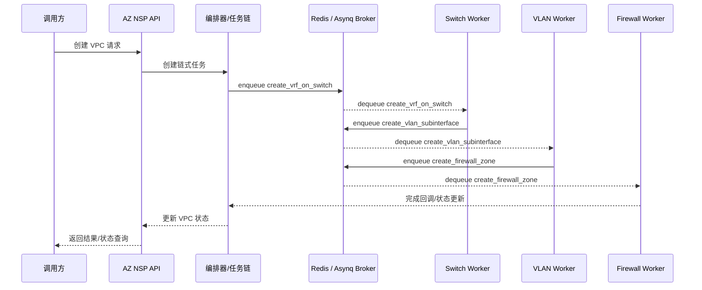

# AZ NSP 与 Worker 链式异步任务交互图

本页用于说明 **AZ NSP** 与 **Worker** 之间的链式异步任务交互方式，聚焦在 VPC 工作流的链式编排与任务流转。

## 交互说明

1. **AZ NSP 接收请求**：调用方提交创建 VPC 的请求，AZ NSP API 将其交给编排器处理。
2. **编排器生成链式任务**：编排器按顺序将任务入队，首任务为 `create_vrf_on_switch`。
3. **Worker 依次消费**：每个 Worker 从 AZ 专属队列中取出任务执行，并在完成后把“下一步任务”入队。
4. **状态回写**：最后一个任务完成后回写状态，AZ NSP 更新 VPC 工作流状态并响应调用方。

## 关键特性

- **队列隔离**：按 AZ 维度使用独立队列（`vpc_tasks_{region}_{az}`），避免跨 AZ 竞争。
- **链式推进**：每个任务完成即入队下一个任务，形成严格顺序的执行链。
- **易扩展**：如需新增任务类型，只需在任务链中追加新任务并注册对应 Worker 处理器。
